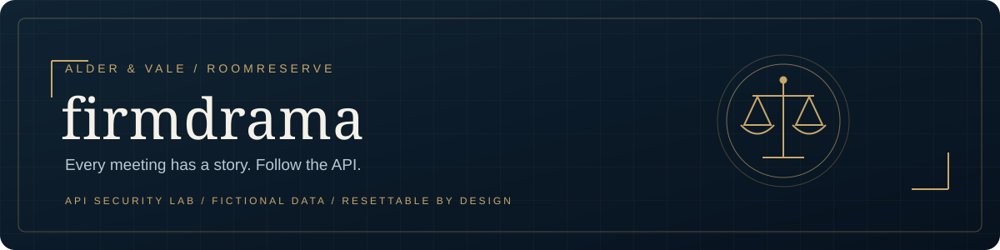

<p align="center">
  <strong>Created by Ziad Osama El-Boshy</strong><br>
  <sub>Challenge author &amp; creator</sub>
</p>

# firmdrama documentation

**Task 01 · Documentation index and submission guide · Reviewed 10 September 2026**

> **Audience:** Maintainers and evaluators. These documents contain spoilers;
> provide only the [player README](../README.md) as player instructions.

Use this index to navigate the challenge documentation, locate the assessment's
required deliverables, and prepare the complete source package. This index is
a supporting guide, not a separately required assessment deliverable.

[Documentation](#documentation-set) · [Assessment coverage](#assessment-coverage) · [Packaging](#packaging) · [Acceptance](#release-acceptance)

## Submission at a glance

| Item | Detail |
| :--- | :--- |
| Challenge | firmdrama / RoomReserve |
| Assessment | Practical Internship Task - CTF Building: API & Web Security |
| Primary family | Advanced API Chaining |
| Difficulty / expected duration | Hard / 75-120 minutes |
| Deployment | Flask, Gunicorn, and MySQL behind a separate TCP ingress |
| Documentation | Eight focused guides, a maintainer OpenAPI reference, and a local banner asset |
| Release status | [Current evidence and acceptance decision](validation-report.mdx#release-decision) |

## Documentation set

Read the player guide first, then use the document that matches your task.
Each subject has one primary home; related documents link to it.

| # | Document | Audience | Authoritative content |
| :--- | :--- | :--- | :--- |
| 01 | [Player README](../README.md) | Players | Scenario, prerequisites, startup, one-time hash initialization, local flag checking, connection, reset, flag format, rules |
| 02 | [Challenge design](challenge-design.mdx) | Designers and evaluators | Learning objective, story, roles, boundaries, implementation reference, design decisions |
| 03 | [Official solution](official-solution.mdx) | Evaluators | Existing intended walkthrough and completion criteria |
| 04 | [Security report](security-report.mdx) | Security reviewers | Assessment sections 9.1-9.14 and sanitized evidence appendix |
| 05 | [Remediation guide](remediation.mdx) | Security reviewers | Root causes, secure-state controls, and expected retest outcomes |
| 06 | [Operations runbook](operations.mdx) | Operators | Deployment, ingress, configuration, reset, validation commands, controls, residual risks, maintenance |
| 07 | [Validation report](validation-report.mdx) | Release owner and independent reviewer | Dated results, coverage limits, release gates, independent acceptance record |
| 08 | [Documentation index](README.md) | Maintainers and submission reviewers | This index, assessment mapping, and package contents |

### Maintainer API reference

The [OpenAPI specification](openapi.yaml) is the machine-readable companion to
the design reference. It covers all 20 explicit JSON operations, including
health and the retired-version response, with request and response schemas,
authentication, headers, errors, and synthetic examples.

This is supporting evaluator material, not an additional PDF-required
deliverable or a second player guide. Include it in the complete source project;
keep it out of spoiler-free player handouts and the challenge's HTTP surface. The application does
not serve the file, and `docs/` is excluded from the Docker build context.
Follow the [operations instructions](operations.mdx#maintainer-api-reference)
to inspect and validate it. The [validator](tools/validate_openapi.py) and its
[dependencies](tools/requirements.txt) ship with the specification.

### Reading conventions

The project-root `README.md` is the player guide; `docs/README.md` is this
documentation index. The six `.mdx` guides use Markdown, basic HTML, and fenced
Mermaid diagrams. Use a Mermaid-capable preview for
diagrams; tables and prose also describe the essential content.

A document review date does not imply a fresh build, scan, or full test run.
The validation report is the single source for dated results and acceptance.
Retain sanitized placeholders wherever evidence includes runtime secrets.

## Assessment coverage

### Section 8: required deliverables

This table maps all nine required deliverables to the submission. File presence
and documentation coverage are distinct from completed release acceptance.

| # | Required item | Submitted material | Verification reference |
| :--- | :--- | :--- | :--- |
| 01 | Working challenge application | [Source](../src/), [database](../database/), [startup](../entrypoint.sh) | Health and functional coverage |
| 02 | Docker deployment | [Application Dockerfile](../Dockerfile), [ingress Dockerfile](../Dockerfile.ingress), [Compose](../docker-compose.yml), [proxy](../ingress_proxy.py) | [Operations](operations.mdx) and validation |
| 03 | Player-facing README | [README.md](../README.md) | All required player-facing guidance |
| 04 | Source and configuration | [Source](../src/), [database](../database/), [scripts](../scripts/), [environment example](../.env.example) | Build and configuration review |
| 05 | Controlled challenge flags and hashes | [Runtime generator](../scripts/generate_flags.py), [reset](../reset.py), [hash initializer](../scripts/sync_flag_hash.py), [local checker](../scripts/check.py), [lab metadata](../lab.yml) | [Flag lifecycle](challenge-design.mdx#determinism-and-flag-design), [hash synchronization](operations.mdx#keep-the-lab-metadata-hashes-current), and reset coverage |
| 06 | Official solution / report | [Official solution](official-solution.mdx), [security report](security-report.mdx) | Sections 9.1-9.14; [sanitized evidence](security-report.mdx#appendix-a-sanitized-evidence) |
| 07 | Remediation documentation | [Remediation guide](remediation.mdx) | Secure-state design and retest matrix |
| 08 | Health / automated validation | `/health`, [tests](../tests/), [release validator](../scripts/validate_release.ps1) | [Dated results and coverage limits](validation-report.mdx) |
| 09 | Challenge design | [Design and technical appendices](challenge-design.mdx) | Scenario, objective, roles, API contract, boundaries, lifecycle |

### Other assessment requirements

| Assessment area | Where it is addressed |
| :--- | :--- |
| Scope, safety, and isolation | Player rules; design guardrails; operations controls and residual risks |
| Challenge metadata and primary family | Design brief, learning objective, and story |
| Quality and integrity | Design boundaries; report section 9.13; validation coverage |
| Complete technical report | Security report sections 9.1-9.14, with evidence in Appendix A |
| Clean-environment validation | Operations workflow and validation evidence ledger |
| Independent verification and evaluator checks | Validation release gates, acceptance procedure, and reviewer record |

## Packaging

Submit the `firmdrama/` directory with the following structure. All documentation
links resolve within this directory; no separate task-level decision file is needed.

```text
firmdrama/
|-- README.md
|-- Dockerfile
|-- Dockerfile.ingress
|-- Dockerfile.ingress.dockerignore
|-- docker-compose.yml
|-- ingress_proxy.py
|-- entrypoint.sh
|-- reset.py
|-- .env.example
|-- .dockerignore
|-- .gitignore
|-- .gitattributes
|-- lab.yml                       # current final and checkpoint SHA-256 digests
|-- src/                          # include static assets and templates
|-- database/
|-- scripts/
|   |-- check.py                  # host-side two-stage flag checker
|   |-- sync_flag_hash.py          # host-side current-hash synchronizer
|   `-- validate_release.ps1       # host-side release workflow
|-- tests/
|-- solver/                       # evaluator-only
`-- docs/                         # evaluator-only
    |-- README.md                 # documentation index and submission guide
    |-- challenge-design.mdx
    |-- official-solution.mdx
    |-- security-report.mdx
    |-- remediation.mdx
    |-- operations.mdx
    |-- validation-report.mdx
    |-- openapi.yaml               # complete maintainer JSON API reference
    |-- tools/
    |   |-- validate_openapi.py    # static documentation checks
    |   |-- test_check.py           # host-side checker regression checks
    |   |-- test_host_reset.py      # host-side reset-helper regression checks
    |   |-- test_sync_flag_hash.py  # host-side hash synchronizer regression checks
    |   `-- requirements.txt      # host-only documentation dependencies
    `-- assets/
        `-- firmdrama-banner.svg
```

The [.gitignore](../.gitignore) excludes local configuration, credentials,
environments, caches, generated evidence, logs, and backup/export artifacts.
Keep `.env.example`, the database source files, tests, evaluator solver, and
all official deliverables. Do not include runtime flags, tokens, approvals,
database dumps, or unredacted screenshots. For manual copying, exclusions are
not automatic: copy the clean project directory, including its dotfiles, and
leave any subsequently regenerated `tmp/`, `output/`, or cache directories behind.

[.gitattributes](../.gitattributes) establishes LF text line endings for Windows
and Linux checkouts. The [application ignore rules](../.dockerignore) and
[ingress-specific rules](../Dockerfile.ingress.dockerignore) restrict build
inputs independently of Git. See [repository hygiene](operations.mdx#repository-hygiene)
for the maintenance policy.

The GitHub repository is the complete open-source challenge project. It
intentionally includes the official solution, evaluator documents, and OpenAPI
reference alongside the application, tests, and solver. Audience labels
describe each document's purpose, not repository access restrictions. Evaluator
material remains outside the running challenge's HTTP surface and spoiler-free
player handouts used for an unaided acceptance exercise.

The supplied example Docker project and assessment PDF are reference inputs.
Preserve those originals outside the challenge package unless the evaluator
requests them. This guide defines package contents; it does not assert that
an archive has been created or accepted.

## Release acceptance

The [validation report](validation-report.mdx#release-decision) records the
release-owner's 9 September 2026 clean-environment acceptance and publication
decision. For a material future release, repeat the full release workflow,
review current image-scan results, and record an independent deployment, reset,
and unaided solve. Preserve reviewer identity, date, environment, outcome, and
any corrections in the acceptance record.

---

[Documentation index](README.md) · [Operations](operations.mdx) · [Validation and acceptance](validation-report.mdx)
