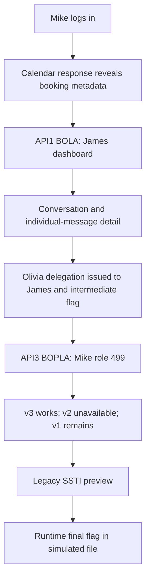
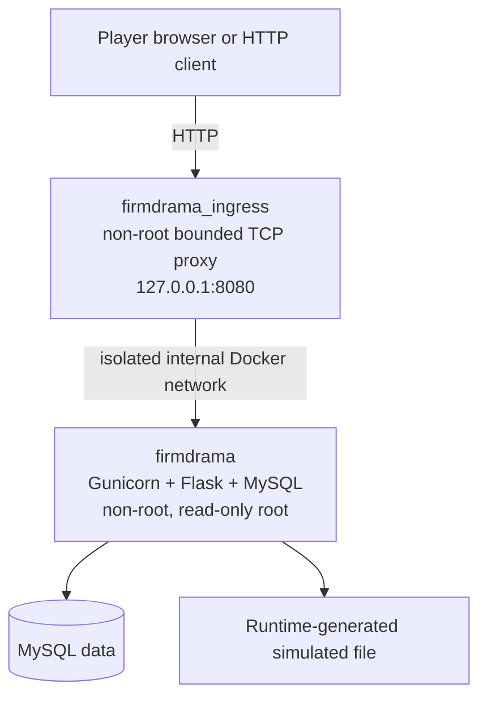

  <strong>Created by Ziad Osama El-Boshy</strong> 
  Challenge author &amp; creator

# Challenge design

**firmdrama · Designer and evaluator edition · Reviewed 10 September 2026**

> **Design status:** Implemented and approved for publication after the
> release owner's clean-environment installation, manual validation, and an
> independent clean-environment acceptance review on 9 September 2026. See the
> [validation report](validation-report.mdx) for bounded automated evidence.

[Design brief](#design-brief) · [Architecture](#architecture-and-trust-boundaries) · [Implementation reference](#appendix-a-implementation-reference) · [Decisions](#appendix-b-design-decisions)

## Design brief

| Attribute | Decision |
|---|---|
| Scenario | RoomReserve, Alder & Vale's internal meeting-room and Facilities portal |
| Primary family | Advanced API Chaining |
| API weaknesses | API1:2023 BOLA, API3:2023 BOPLA, API9:2023 Improper Inventory Management |
| Secondary weakness | SSTI, OWASP Top 10:2021 A03 Injection |
| Difficulty | Hard |
| Expected solve time | 75-120 minutes |
| Player starting point | Mike, Associate, role `1` |
| Required skills | HTTP methods, JSON, bearer sessions, and API response analysis |
| Prerequisites | Docker with Linux containers, Compose v2+, and a browser or HTTP client |
| Completion proof | Two independent runtime-generated `duck{...}` values |

## Learning objective

Demonstrate how individually plausible failures can be chained across trust
boundaries: discovery metadata becomes an authorization surrogate, a protected
profile property is accepted through a generic update flow, a retired API
version remains reachable, and a legacy renderer executes attacker-controlled
template source. The lesson is the chain, not any one endpoint in isolation.

## Story and actors

Mike has normal associate access to RoomReserve. He notices a confidential
partner booking owned by James, a senior partner. James is privately arguing
with Olivia, the managing partner, about Mike's future at the firm. Their
conversation contains a temporary Executive Facilities delegation issued to
James for a sensitive matter. The story uses fictional names, people,
meetings, and matter codes only.

| Actor | Role | Role ID | Player relevance |
|---|---|---:|---|
| Mike | Associate | `1` | Only player-login account and initial attacker identity |
| James | Senior Partner | `3` | Non-administrator victim and conversation owner |
| Facilities Operations | Facilities Operator | `10` | Supporting operational data owner |
| Olivia | Managing Partner | `499` | Source of the temporary delegation and final target context |

## Intended chain

### Stage boundaries

1. **API reconnaissance.** A normal calendar response contains limited
   occupied-room metadata. The UI displays business details but does not link
   to the partner's workspace.
2. **API1 BOLA.** A booking-to-dashboard relationship is incorrectly treated
   as authorization to retrieve James's dashboard. Mike's session identity
   stays Mike.
3. **Conversation investigation.** Dashboard and conversation responses reveal
   relationships and summaries. Olivia's final summary ends with the literal
   `duck{` prefix; only individual message detail reveals the complete body,
   flag, approval ID, and sender-role metadata.
4. **API3 BOPLA.** Mike's normal profile save includes his current `role_id`
   and a `"NULL"` approval placeholder. The delegation issued to James is
   valid only for target role `499`. The service checks that target, expiry,
   and one-time use, but deliberately omits the recipient and source-role
   checks, so Mike can redeem it.
5. **API9 inventory exposure.** The role-gated modern Facilities API is v3,
   v2 is unavailable, and a deprecated v1 surface remains deployed.
6. **Legacy SSTI.** The v1 preview evaluates the supplied template source
   inside the disposable application container and exposes the simulated final
   file.

## Architecture and trust boundaries

| Boundary | Intended behavior | Deliberate exception |
|---|---|---|
| Player to API | Opaque authenticated session and normal role checks | Dashboard relation is treated as authorization |
| Dashboard to conversation | Nested relationship validation | James's BOLA-authorized dashboard context can traverse James's conversation |
| Profile update | Mike can edit only Mike's record | Generic update accepts role `499` with a stolen approval intended for James |
| Current to legacy Facilities API | v3 uses a safe renderer | v1 remains reachable after version enumeration |
| Application container to host | Isolated IPv4 internal bridge, no host gateway, host mounts, Docker socket, or privileged mode | None |

The ingress image is a separate digest-pinned Python/Alpine runtime. It copies
only the proxy source and forwards to the internal app. Connection teardown
propagates peer closure, cancels the remaining forwarding task, and releases
the slot. See the [operations runbook](operations.mdx) for exact limits and the
separate ingress regression check.

## UI contract

The UI is intentionally a polished convenience layer, not a solve shortcut.
It provides normal authenticated pages for dashboard, calendar, rooms,
conversations, profile, notifications, personal requests, and role-appropriate
Facilities access. Server-side page guards protect authenticated pages and the
Facilities page requires role `499`.

The following transitions are deliberately API-only:

- victim dashboard navigation;
- cross-dashboard conversation traversal and individual private message bodies;
- protected role/delegation fields;
- v1/v2/v3 enumeration; and
- legacy preview execution.

## Determinism and flag design

| Item | Contract |
|---|---|
| Intermediate checkpoint | Appears only in Olivia's final detailed message, immediately before the approval ID |
| Final completion flag | Appears only after the intended legacy preview result |
| Value shape | `duck{24 lowercase characters}` |
| Reset effect | Restores roles, data, sessions, relationships, and a fresh approval; generates fresh independent values |
| Plaintext flag exclusions | Source, static assets, committed configuration, image layers, metadata, logs, unrelated responses |
| Host metadata | `lab.yml` stores SHA-256 digests only: `flag_hash` for final completion and `checkpoint_flag_hash` for the intermediate checkpoint |
| Hash synchronization and local checking | The host helper reads both stages once after startup and updates both digests together. Host `reset.py` performs the same update after each clean reset. The zero-dependency host checker compares one captured value with those current digests and reports its stage; see [operator instructions](operations.mdx#keep-the-lab-metadata-hashes-current) |

## Difficulty and safety

The challenge is Hard because a player must connect several standard
techniques across authorization, inventory, and renderer boundaries. Every
transition is observable through normal API behavior, but the full chain
requires deliberate API investigation. It does not require source access, blind brute force, obscure framework internals,
or external knowledge of the fictional setting.

- All accounts, data, messages, and flags are fictional and local.
- The application is disposable and resettable.
- The application network is internal; only ingress publishes a loopback port.
- Containers run non-root with read-only roots, dropped capabilities,
  `no-new-privileges`, PID limits, and bounded writable tmpfs paths.
- There are no host mounts, Docker socket mounts, privileged containers,
  published database ports, external callbacks, persistence features, or
  destructive challenge actions.

## Appendix A. Implementation reference

This appendix defines the observable application contract. Maintain it whenever
routes, response fields, role boundaries, seeded relationships, reset behavior,
or the player interface change. Operational commands and runtime settings are
maintained in the [operations runbook](operations.mdx).

The [maintainer OpenAPI reference](openapi.yaml) supplies machine-readable schemas
for all 20 explicit JSON operations, including `/health` and the retired v2
response. Keep it aligned with this appendix and the implemented source.
It is evaluator material and is not exposed through the player application;
see [usage and validation](operations.mdx#maintainer-api-reference).

### A.1 API conventions

- JSON is used for request and response bodies.
- Protected API routes accept `Authorization: Bearer <session_token>` or the
  browser session cookie. A nonempty Authorization header takes precedence
  and prevents cookie fallback, even when malformed.
- Browser authentication uses an HttpOnly, `SameSite=Strict` session cookie.
  Browser state-changing requests include the `X-firmdrama-Client: browser`
  header; bearer-client requests use the Authorization header.
- Response timestamps are UTC ISO 8601 strings. Booking timestamps require seconds
  and an explicit `Z` or numeric offset, with up to six fractional digits preserved
  in `DATETIME(6)`. They are
  normalized to UTC within MySQL's supported years 1000-9999. The browser shows
  local time with a timezone label. Room IDs must be positive JSON integers.
- Errors use `{"error":"short_code","message":"human-readable explanation"}`.
- All numeric challenge IDs are deterministic across resets; session tokens,
  flags, and delegation approval IDs are not.

### A.2 HTTP surface

#### Public and normal-user routes

| Method | Route | Access | Purpose |
|---|---|---|---|
| `GET` | `/health` | Public | Readiness only; returns `status` and `service` |
| `POST` | `/api/v1/auth/login` | Public | Creates opaque session; returns token and user summary |
| `POST` | `/api/v1/auth/logout` | Authenticated | Revokes current session |
| `GET` | `/api/v1/me` | Authenticated | Current profile, permissions, and own dashboard identifier |
| `GET` | `/api/v1/rooms` | Authenticated | Room availability and business metadata |
| `GET` | `/api/v1/bookings/calendar` | Authenticated | Seeded booking data links Mike to dashboard `1001` and the intentional partner booking to dashboard `1042` |
| `POST` | `/api/v1/bookings` | Authenticated | Normal room booking |
| `DELETE` | `/api/v1/bookings/{booking_id}` | Owner only | Normal cancellation |
| `GET` | `/api/v1/maintenance-requests` | Authenticated | Current user's own request summaries only |
| `GET` | `/api/v1/notifications` | Authenticated | Neutral current-user schedule/account notices |
| `PATCH` | `/api/v1/users/{user_id}/profile` | Own object only | Normal profile update and intentional protected-property defect |

#### Intentional challenge routes

| Method | Route | Expected behavior |
|---|---|---|
| `GET` | `/api/v1/dashboards/{dashboard_id}` | BOLA stage: exposed booking relation can retrieve James's dashboard while Mike remains authenticated |
| `GET` | `/api/v1/dashboards/{dashboard_id}/summary` | Provides dashboard metadata and nested conversation relation |
| `GET` | `/api/v1/dashboards/{dashboard_id}/conversations` | Provides conversation summaries only |
| `GET` | `/api/v1/dashboards/{dashboard_id}/conversations/{conversation_id}` | Provides message previews, not bodies or role IDs |
| `GET` | `/api/v1/dashboards/{dashboard_id}/conversations/{conversation_id}/messages/{message_id}` | Provides individual full message detail and sender role metadata |
| `GET` | `/api/v3/dashboard` | Role `499`; modern Facilities overview and safe renderer |
| `GET` | `/api/v2/dashboard` | Role `499`; standard `404` retirement behavior |
| `GET` | `/api/v1/dashboard` | Role `499`; deprecated legacy dashboard and preview relation |
| `POST` | `/api/v1/tickets/{ticket_id}/preview` | Role `499`; intentional v1 SSTI confined to the container |

#### Browser page contract

`/dashboard`, `/calendar`, `/rooms`, `/profile`, `/conversations`,
`/conversations/{id}`, `/requests`, and `/notifications` require a browser
session at the server. `/facilities` additionally requires role `499` at the
server. The UI must never introduce a direct route or control for the
challenge-only transitions listed in the design document.

### A.3 Seed graph and response boundaries

| Object | Fixed value | Boundary |
|---|---:|---|
| Mike dashboard | `1001` | Mike's ordinary dashboard |
| James dashboard | `1042` | Exposed through booking metadata; BOLA target |
| Olivia dashboard | `1499` | Must not be reachable as a shortcut |
| James booking | `7001` | Calendar record tied to dashboard `1042` |
| James-Olivia conversation | `5001` | Available only in James's BOLA-authorized dashboard context |
| Messages | `9001`-`9006` | Six-message dispute; only individual detail includes bodies/role IDs |
| Secure Facilities ticket | `3001` | v3 only |
| Legacy ticket | `1001` | v1 only |
| Mike request | `4001` | Normal user-scoped UI data; unrelated to the chain |

Only Olivia's final detailed message contains the temporary approval and
intermediate flag. The final flag lives in the simulated runtime file and is
not reachable through a normal HTTP file route.

### A.4 Intentional defect boundaries

<strong>API1 BOLA</strong>

The dashboard resolver deliberately accepts the seeded booking-to-dashboard
relationship as authorization. It must not authorize Olivia's dashboard,
arbitrary dashboards, or change Mike's session identity.

<strong>API3 BOPLA</strong>

Only Mike may update Mike's profile. A changed `role_id` must be `499` and
requires a valid, unexpired approval whose recorded target is also `499`.
The deliberate defect omits both the intended-recipient comparison and the
source-role check. Mike can therefore redeem James's approval despite starting
at role `1`. Other role changes, other-user edits, invalid approvals, expired
approvals, and replay fail.

<strong>API9 and SSTI</strong>

v3 is the safe current Facilities surface. v2 is unavailable. v1 is the
intentional retired inventory exposure and is not player-documented. The v1
preview alone uses dynamic Jinja rendering; v3 must remain inert for template
expressions.

### A.5 Runtime and reset contract

1. Startup initializes MySQL, seeds deterministic records, and generates fresh
   runtime flag and approval values before Gunicorn becomes healthy.
2. Host-side `reset.py` closes ingress and recreates the application from its
   existing image. Startup restores seeded state, role `1`, fresh flags, and a
   new eight-hour approval. The host verifies state, refreshes checker hashes,
   recreates ingress, and checks the published endpoint. Old processes and tmpfs
   files are discarded; reset failure leaves ingress stopped.
3. The `firmdrama` service contains MySQL and Gunicorn under the non-root
   `firmdrama` account. Its root filesystem is read-only; MySQL state, sockets,
   logs, and the simulated final-file directory use bounded tmpfs paths.
4. `firmdrama_ingress` is a separate non-root, standard-library TCP proxy. It
   is the only published service and binds `127.0.0.1:8080` locally.
5. The ingress image copies only its standard-library proxy; `pip` and
   `ensurepip` are removed. Compose admits at most 64 forwarding sessions, sets
   directional read/write timeouts to 30 seconds and connection/close timeouts
   to 3 seconds. Client write-side EOF is forwarded upstream while allowing a
   bounded response to complete. Response completion or failure cancels and awaits
   remaining work, closes both sockets, and releases the slot. These are connection controls, not an HTTP retry or TLS layer.
6. No container has a host mount, Docker socket, privileged mode, published DB
   port, added Linux capability, or external service dependency.

### A.6 Required regression evidence

The release suite must cover health, authentication, ordinary booking/profile
behavior, message redaction, intended challenge boundaries, reset randomization,
no-shortcut behavior, runtime permissions, network topology, image separation,
and static/image-metadata flag secrecy. Ingress tests run separately because
the application image deliberately omits the proxy module.

Use the [validation workflow](operations.mdx#validation-workflow) for commands
and the [validation report](validation-report.mdx) for dated results and acceptance.

## Appendix B. Design decisions

The decision identifiers below preserve the approved design baseline. Detailed
behavior is specified in the main design and Appendix A.

| ID | Decision | Final state |
|---|---|---|
| D-01 | Primary family | Advanced API Chaining |
| D-02 | Scenario | Fictional Alder & Vale RoomReserve portal |
| D-03 | Attacker | Mike, ordinary associate account, role `1` |
| D-04 | Chain | BOLA -> conversation detail -> BOPLA -> API9 -> SSTI |
| D-05 | Difficulty | Hard; 75-120 minutes |
| D-06 | Delivery | Flask/Gunicorn/MySQL app behind separate loopback ingress |
| D-07 | Flags | Two independent runtime-generated `duck{24 lowercase characters}` values |
| D-08 | UI | Polished normal portal; critical chain transitions remain API-only |
| D-09 | Containment | Internal app network, non-root/read-only containers, no host mounts/socket/privileged mode |
| D-10 | Validation | Resettable, automated API-only solver, no-shortcut tests, separate ingress regression, and release-owner clean-environment acceptance |
| D-11 | Ingress lifecycle | Preserve bounded responses after client half-close; cancel remaining work, close writers, and release the slot on response completion or failure |
| D-12 | Documentation entry points | Project-root `README.md` is the player guide; `docs/README.md` is the maintainer/evaluator documentation index |
| D-13 | API reference distribution | Complete OpenAPI specification included in the public source project for maintainers/evaluators; excluded from spoiler-free player handouts and container builds |

### Design guardrails

- All users, records, flags, and sensitive information are simulated.
- The final flag is generated on startup/reset and absent from source, static
  assets, committed config, image layers, metadata, logs, and unrelated routes.
- James remains a non-administrator. Mike is the only role-changing player.
- The UI does not link to James's dashboard, expose private message details,
  expose role/delegation fields, enumerate legacy APIs, or execute previews.
- The SSTI is constrained to the disposable challenge container; no host,
  Docker socket, persistence, external callback, or destructive behavior is
  part of the design.
- Independent clean-environment deployment, reset, and solve completed before
  publication; repeat it after material future changes as quality control.

---

[Documentation index](README.md) · [Operations](operations.mdx) · [Validation and acceptance](validation-report.mdx)
