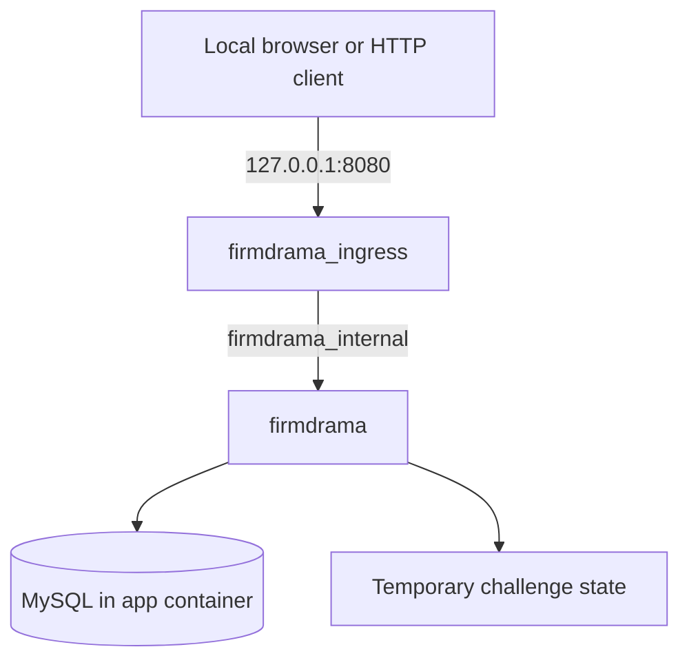

<p align="center">
  <strong>Created by Ziad Osama El-Boshy</strong><br />
  <sub>Challenge author &amp; creator</sub>
</p>

# Operations runbook

**firmdrama · Operator edition · Reviewed 10 September 2026**

> **Audience:** Challenge owners and authorized operators. This runbook includes
> deployment details and challenge spoilers.

[Topology](#service-topology) · [Startup](#start-the-lab) · [Ingress update](#ingress-image-and-connection-lifecycle) · [Validation](#validation-workflow) · [Troubleshooting](#troubleshooting) · [Residual risks](#residual-risk-register) · [Maintenance](#maintenance-and-change-control)

## Service topology



| Service | Responsibility | Network exposure |
| :--- | :--- | :--- |
| `firmdrama` | Flask, Gunicorn, MySQL, startup/reset, challenge data | Only `firmdrama_internal`; no host port publication |
| `firmdrama_ingress` | TCP forwarding to `firmdrama:8000` | Internal network plus publishing bridge; sole host binding `127.0.0.1:8080` |

The internal network remains `internal: true`. The additional ingress bridge
supports Docker Desktop host forwarding without attaching the application to
that bridge. Ingress forwards TCP bytes; it does not terminate TLS, inspect
HTTP requests, or act as an HTTP authorization layer.

## Start the lab

Run commands from the `firmdrama` directory. Docker must use Linux containers
and Compose v2 or later. Image and package downloads require internet access
during the first build; normal runtime operation needs no external service.

```powershell
docker compose up -d --build
docker compose ps
Invoke-RestMethod http://127.0.0.1:8080/health
```

Wait until **both services are healthy** before using the health URL or opening
the application. The expected response is:

```json
{"service":"firmdrama","status":"ok"}
```

## Ingress image and connection lifecycle

The ingress image uses the digest-pinned `python:3.12-alpine` base in
[Dockerfile.ingress](../Dockerfile.ingress). It copies only
[ingress_proxy.py](../ingress_proxy.py), uses the Python standard library, and
runs as the non-root `ingress` user. The Dockerfile removes `pip` and
`ensurepip`; this reduces packaged tooling but does not constitute a current
vulnerability scan or a guarantee of zero vulnerabilities.

The proxy preserves responses when a client cleanly half-closes its sending
side. It forwards that EOF upstream and gives the response a bounded completion
window. Upstream closure, read/write timeout, or failure cancels remaining work,
closes both connections, and releases the connection slot. This prevents an upstream close from leaving the browser
connected to a stale socket. It is connection-level cleanup, not HTTP retry or
response-aware buffering.

| Setting | Current value | Meaning |
| :--- | :--- | :--- |
| `FIRMDRAMA_UPSTREAM_HOST` | `firmdrama` | Default upstream hostname in proxy source |
| `FIRMDRAMA_UPSTREAM_PORT` | `8000` | Default upstream port in proxy source |
| `FIRMDRAMA_MAX_CONNECTIONS` | `64` | Maximum concurrent admitted forwarding sessions |
| `FIRMDRAMA_IDLE_TIMEOUT_SECONDS` | `30` | Timeout for each read/write and response completion after client EOF |
| `FIRMDRAMA_CONNECT_TIMEOUT_SECONDS` | `3` | Timeout for opening upstream and closing writers |
| Admission wait | `0.05` seconds | Source-defined wait for a slot before the connection closes |

The three limit variables are set directly in Compose. Upstream host and port
use source defaults unless explicitly passed to the ingress container. The
idle timeout bounds reads and writes, plus response completion after client EOF.
Writer closure is bounded by the connection timeout. Active connections do not
otherwise have an overall lifetime limit.
Gunicorn's configured keep-alive is 2 seconds; peer-close propagation matters
even while the proxy's own read timeout has not elapsed.

### Apply an ingress-only update

With a healthy application already running:

```powershell
docker compose build firmdrama_ingress
docker compose up -d --no-deps firmdrama_ingress
docker compose ps
```

Wait for ingress to become healthy, then verify `/health` through the published
URL. A restart alone does not copy changed source into an existing image.
This targeted workflow replaces ingress and briefly interrupts connections;
it does not invoke the application reset routine.

## Configuration

Compose explicitly passes these configurable values into the application:

| Variable | Local default | Operator guidance |
| :--- | :--- | :--- |
| `FIRMDRAMA_DB_PASSWORD` | Development-only fallback in Compose | Supply a unique secret for hosted delivery |
| `FIRMDRAMA_TRUSTED_HOSTS` | `localhost,127.0.0.1,firmdrama` | Retain health-check hostnames and add the exact hosted hostname |
| `FIRMDRAMA_COOKIE_SECURE` | `false` | Set `true` for a hosted HTTPS endpoint |
| `FIRMDRAMA_MAX_CONTENT_LENGTH` | `65536` bytes | Application request-body limit |

Use shell environment values or an uncommitted `.env` for Compose substitutions.
[.env.example](../.env.example) also lists direct-application settings; Compose
does not automatically pass every listed variable into containers. In
particular, Compose explicitly sets the application environment to `production`
and requires the database, regardless of the example's development setting.

## Reset and temporary storage

```powershell
python reset.py
```

Run `reset.py` on the host. An OS file lock prevents overlapping resets for this
checkout and releases automatically if the helper exits. The helper stops ingress,
recreates the application using existing local images without building or pulling,
waits for health, verifies generated state and starting role/session state, and
atomically refreshes both hashes in `lab.yml`. It then recreates ingress and checks
`http://127.0.0.1:8080/health` before reporting success. Failures stop ingress and
return a nonzero status; retry after resolving the error.

Recreation removes old processes, Python memory, and writable tmpfs contents.
Startup restores seeded records, revokes old sessions, restores Mike to role `1`,
and generates fresh flags and an eight-hour delegation approval. All progress is
lost; sign in again. The source checkout and existing images are retained. The
host helper is excluded from container build contexts and exposes no Docker socket
to the application. Integration tests reseed controlled fixtures inside the test container;
that test setup is not a player-facing security reset.

### Keep the lab metadata hashes current

The host-side [helper](../scripts/sync_flag_hash.py) reads both stages from one
database snapshot inside the running `firmdrama` container, checks that they
belong to the same reset, and verifies the final flag against its runtime file.
Only the two SHA-256 digests leave the container. It updates both fields in
[lab.yml](../lab.yml) together using an atomic file replacement, preserving
the remaining metadata and comments.

| Metadata field | Meaning |
| :--- | :--- |
| `flag_hash` | SHA-256 of the full final completion flag, including braces |
| `checkpoint_flag_hash` | SHA-256 of the full intermediate checkpoint flag, including braces |

`flag_hash` retains the original single-flag field name. The additional
`checkpoint_flag_hash` identifies the intermediate stage. The helper only
synchronizes metadata. The shared host-side [checker](../../../../scripts/check.py)
compares one player-supplied value against both current digests and reports
either `checkpoint solved`, `solved`, or `not solved`; it does not call the
application or retain plaintext flags.

Python 3.10 or later and Docker Compose are required on the host, with no
additional Python packages. The player-facing [quick start](../README.md#2-initialize-the-flag-hashes)
includes the same setup for local players; hosted deployments run it on the
operator's Docker host.

After Docker startup reports both services healthy, run once on the host:

```powershell
python scripts/sync_flag_hash.py
```

The command calls `sync_flag_hashes()` once, updates both hashes or reports that
they already match, and exits. Failure returns a nonzero status and preserves
the previous metadata. Fix the startup issue and retry. There is no background
process, polling, or watcher option.

Run it again after a direct Docker restart or container recreation. Host-side
`reset.py` already calls `read_running_hashes()` and `update_metadata()` before
reporting success, so a clean reset requires no separate synchronization step.
Flags are generated at container startup, not during image build; synchronization
must run after startup. Neither function prints or saves plaintext flags on the
host. If your system uses `python3`, substitute it for `python`.

### Check a captured flag

From the challenge root, after initializing `lab.yml`, run:

```powershell
python ../../../scripts/check.py .
```

The zero-dependency checker prompts for one flag and compares its SHA-256
digest with both metadata fields. It returns exit code `0` for a checkpoint or
final match, `1` for a non-match, and `2` for usage or metadata errors. It is a
host-side player aid, not a container service: it is deliberately excluded from
the application image and requires no Docker access. A hosted organizer that
distributes the checker must distribute the matching current `lab.yml` too.

The hashes describe this local instance only. Another installation generates
its own flags and must run the helper against that instance.

Host-side regression checks cover metadata preservation, invalid or incomplete
hash pairs, write failures, Docker failures, one-time synchronization, reset locking,
reset ordering, failure handling, and the rule that reset never downloads images:

```powershell
python -m unittest discover -s docs/tools -p test_*.py
```

## Maintainer API reference

[docs/openapi.yaml](openapi.yaml) describes every explicit JSON API operation
and `/health` using [OpenAPI 3.1.1](https://spec.openapis.org/oas/v3.1.1.html).
It includes current and legacy namespaces, the retired v2 response, request
and response schemas, authentication, response headers, and application errors.
HTML pages, static files, and implicit `HEAD`/`OPTIONS` methods are outside its
scope. The [design appendix](challenge-design.mdx#appendix-a-implementation-reference)
owns narrative behavior and challenge decisions; the YAML owns the structured
API reference.

Include the specification in the complete public-source project and evaluator
package. It is not served by Flask,
linked from the player README, or included in either container build. Do not
give it to the reviewer during the README-only, unaided acceptance exercise.

### Reading and using the specification

Open the YAML directly or import it into a local tool that supports OpenAPI
3.1. A local Swagger-compatible viewer can provide searchable endpoint groups
and expandable schemas; no documentation server is needed in the challenge.
Use a private local copy when an import tool needs deployment-specific edits.

The default server is `http://127.0.0.1:8080`. Examples are synthetic and may
refer to records that do not exist in the seeded database. They illustrate
data shapes and contain no login credentials, tokens, approvals, or flags.

| Client concern | Contract |
| :--- | :--- |
| API client authentication | Use the issued opaque token in bearer authentication; it is not a JWT |
| Browser login | `X-firmdrama-Client: browser` requests the session cookie |
| Cookie-authenticated writes | Require both the cookie and `X-firmdrama-Client: browser` |
| Credential precedence | A nonempty Authorization header prevents cookie fallback, even if malformed |
| Session lifetime | Two hours; logout and reset invalidate sessions; issuance prunes expired sessions and retains at most 20 per user |
| Login limits | Five reserved attempts per 60 seconds per remote address and trimmed/lowercased ASCII username; success clears its key; 1024 active keys maximum |
| Browser-based API viewers | Cookie behavior depends on browser origin rules; bearer authentication is the practical choice for evaluator clients |
| Booking dates | Send timezone-qualified ISO timestamps; offsets are normalized to UTC and the UI displays local time with a timezone label |
| Collection requests | No pagination or query filters are implemented |

### Validating the reference

From the project root, create a host-only environment and install the
[documentation dependencies](tools/requirements.txt). The initial install
requires access to the Python package index; validation itself uses local files.

```powershell
python -m venv tmp/openapi-tools
.\tmp\openapi-tools\Scripts\python.exe -m pip install -r docs/tools/requirements.txt
.\tmp\openapi-tools\Scripts\python.exe docs/tools/validate_openapi.py
```

For later checks, run only the final command. The
[validator](tools/validate_openapi.py) returns a nonzero exit status on failure.
It checks OpenAPI structure, duplicate YAML keys, local references, example
payloads, explicit source routes, literal response statuses and error codes,
and authentication/role decorators. It also checks selected distribution
boundaries: Docker context exclusion, the player README, and source references.

These are static checks. They do not import Flask, connect to MySQL, send API
requests, validate a deployed image, or prove that every response matches its
schema. Review response fields and conditional behavior against source when
editing the API, and use the separate runtime workflow for release evidence.
The documentation dependencies are excluded from the application images.

## Validation workflow

### Focused ingress regression

From the repository root, with Python available on the host:

```powershell
python -B -m unittest discover -s tests -p test_ingress_proxy.py -v
```

To check the running ingress image using only its Python standard library,
stream the existing test file into it from PowerShell:

```powershell
Get-Content tests/test_ingress_proxy.py -Raw | docker compose exec -T -e PYTHONPATH=/app firmdrama_ingress python3 -B -
```

The six tests cover upstream-close propagation and slot release, client-close
propagation, repeated large responses, delayed responses after client half-close,
stalled writes, and stalled closure. Saturation and every failure scenario are
not covered.

### Application regression

```powershell
docker compose exec -T firmdrama sh -lc "cd /opt/firmdrama-tests && PYTHONPATH=/opt/firmdrama python3 -m pytest -q -p no:cacheprovider"
```

The ingress tests are skipped inside this image because it deliberately omits
the proxy module. A passing application suite therefore does not replace the
separate ingress check.

### Clean release candidate

The existing release validator is
[scripts/validate_release.ps1](../scripts/validate_release.ps1). It requires
PowerShell, Docker Compose, and host Python. The existing evaluator solver
uses the Python standard library; no host `pip install` step is required.

```powershell
.\scripts\validate_release.ps1
```

It removes prior Compose state, builds images with `--pull --no-cache`, starts
the stack, performs reset and application validation, checks the existing
evaluator workflow, verifies runtime controls and topology, and tears down in
a `finally` block. `-KeepRunning` retains containers for inspection, including
when an earlier stage fails; retain the actual exit result when recording
evidence. The script does not run the separate ingress suite or an image scanner.

Run the focused ingress check as part of a future release preparation and
record it alongside the validator result. The [validation report](validation-report.mdx)
records the current release-owner acceptance and future-review guidance.

## Runtime controls

The internal bridge uses `com.docker.network.bridge.gateway_mode_ipv4: isolated`
and explicitly disables IPv6. This removes the bridge host address while
retaining app-to-ingress communication. Docker must support this gateway mode;
upgrade an unsupported engine rather than removing the option. This configuration
was tested with Docker Engine 29.6.2. Changing the gateway mode requires recreating
the Compose network, which also clears this tmpfs-backed lab's current progress.
The release validator recreates the network and verifies the effective settings.

Host port 8080 forwards to ingress port 8000; the application, upstream proxy
connection, and in-container health checks continue to use port 8000.

| Control | Application | Ingress |
| :--- | :--- | :--- |
| User | `firmdrama`, UID/GID `10001` | Named non-root `ingress` user |
| Root filesystem | Read-only | Read-only |
| Linux capabilities | All dropped | All dropped |
| `no-new-privileges` | Enabled | Enabled |
| PID limit | 160 | 64 |
| Memory limit | 768 MiB | 64 MiB |
| CPU limit | 1.0 CPU | 0.25 CPU |
| Host / named-volume / Docker socket mounts | None configured | None configured |

Application tmpfs paths are bounded and use `noexec,nosuid`. MySQL socket/PID
state uses private `/run/mysqld`, not shared `/tmp`. These controls reduce
container capability; they do not restrict an unsafe renderer to one file or
turn the deliberately vulnerable application into a security sandbox.

## Application safeguards

The following controls surround the intentional challenge path. They are
documented implementation controls; current validation scope is recorded in
the [validation report](validation-report.mdx).

| Domain | Implemented control | Verification source |
| :--- | :--- | :--- |
| Authentication | Opaque hashed sessions, rate limiting, logout revocation, browser cookie safeguards | Authentication tests |
| Request handling | JSON/type/length validation, body-size limits, CSRF-style browser header requirement | Application tests |
| Browser hardening | CSP, `nosniff`, frame denial, referrer/permissions policy | Header tests |
| Flag secrecy | Runtime generation, restricted file, no source/static/image-metadata value | Release validator |

Transactions consume the approval atomically when Facilities role `499` is
selected, serialize room availability checks with locking reads, and use
database-generated booking identifiers. These controls address replay, overlapping
reservation races, and booking-ID races without changing the intentional challenge boundaries in the
[design reference](challenge-design.mdx#appendix-a-implementation-reference).

## Residual risk register

firmdrama is an intentionally vulnerable training application. The controls
above reduce exposure; they do not make arbitrary template execution safe or
restrict its effects to the intended file. Use only the documented isolated
lab and hosted HTTP(S)-only trust model.

| ID | Risk | Rating | Treatment / release condition |
|---|---|---:|---|
| RR-01 | Legacy SSTI is deliberate server-side execution | Accepted for lab only | Keep player scope to published endpoint; no host mounts, privileged mode, Docker socket, or external access |
| RR-02 | Ingress uses a non-internal bridge for Docker Desktop forwarding | Medium | Retain loopback binding; apply hosting-platform egress policy when available; never attach app to the publishing bridge |
| RR-03 | Local Compose default database password is development convenience | Medium | Require a unique secret-managed `FIRMDRAMA_DB_PASSWORD` in hosted deployment |
| RR-04 | Cookie secure flag must match TLS deployment | Medium | Require `FIRMDRAMA_COOKIE_SECURE=true` and exact trusted hosts at public TLS edge |
| RR-05 | In-memory login limiter is single-process only | Low | Retain single-worker model or place shared rate limiting/WAF ahead of horizontal scaling |
| RR-06 | Internal bridge could expose Docker-host listeners to the vulnerable app | Mitigated | IPv4-only internal bridge uses isolated gateway mode; release validation rejects a host gateway or missing isolation option |
| RR-07 | Process and scratch-file persistence after intended RCE | Mitigated | Host `reset.py` recreates both containers and verifies fresh state; no SQL-only player reset remains |

### Current scan context

The current rebuilt application and ingress images have no Docker Scout
findings. The application scan indexed 213 packages at digest prefix
`733598548f0c`; the ingress digest prefix is `f7f2f736b163`. These are scanner
results, not a proof that all possible vulnerabilities are absent. See the dated
[validation report](validation-report.mdx) for scope.

### Historical scan context

The earlier hardening review recorded no High or Critical image findings and
confirmed an ingress image with no findings after package-installer removal.
That result is historical evidence, not a claim that this documentation pass
rescanned images. Image digests and vendor advisories must be reviewed again at
the time of public release.

### Review constraints

- Fixed SQL fragments are selected from code allowlists and player-controlled
  values remain parameterized; they are not an SQL injection route.
- Listening on all interfaces inside a container is not a host exposure when the
  app is reachable only on its internal network and ingress alone publishes a
  loopback port.
- A current scanner result must be interpreted with package provenance and
  vendor fix availability; it must not silently replace functional and runtime
  validation.

## Troubleshooting

| Symptom | Check | Action |
| :--- | :--- | :--- |
| Docker connection error | Docker Desktop / Linux engine | Start the Linux engine before Compose |
| Port already allocated | Local use of port `8080` | Stop the conflicting service; retain loopback-only publication |
| Page unavailable | `docker compose ps` | Wait for both services to become healthy |
| Health check fails | `docker compose logs --tail 100 firmdrama firmdrama_ingress` | Review application startup and upstream availability |
| Browser fails after an idle connection | Running ingress image and rebuild status | Apply the ingress update, verify health, then repeat the focused regression |
| Progress or session disappears | Reset / application restart history | Sign in again; temporary state is regenerated |
| Pytest cache warning | Test invocation | Use `-p no:cacheprovider` on the read-only image |

## Hosted deployment

- [ ] Publish only through a platform-managed HTTPS endpoint.
- [ ] Retain the application on its internal network and keep operator controls private.
- [ ] Include health-check hostnames and the exact public hostname in trusted hosts.
- [ ] Set secure cookies and a unique database secret through the platform.
- [ ] Restrict unnecessary egress at the platform boundary.
- [x] Release owner completed a clean-environment installation and manual
  validation for the current publication; see the validation report.
- [x] Independent clean deployment, reset, and unaided solve completed for the
  current publication; reviewer details were not supplied.
- [ ] For a material future release, repeat the automated validation workflow,
  review current image-scan evidence, and obtain an independent deployment,
  reset, and solve from player instructions.

## Maintenance and change control

Any change to routes, responses, seed IDs, reset, UI challenge boundaries,
Docker topology, or runtime controls requires:

1. Update the affected [design specification](challenge-design.mdx#appendix-a-implementation-reference)
   and [OpenAPI reference](openapi.yaml) when the API contract changes.
2. Align the relevant tests and existing evaluator materials with the final behavior.
3. Run the release workflow, including the separate ingress check where relevant.
4. Update dated evidence and reports when observable behavior changes.

| Action | Owner |
|---|---|
| Maintain the API reference and run its static validator after contract changes | Challenge owner |
| Run `validate_release.ps1` after runtime/Compose change | Challenge owner |
| Rebuild pinned images when base-image fixes are available | Challenge owner / platform operator |
| Configure public TLS, hosts, secrets, and egress policy | Hosting operator |
| Independent README-only acceptance | Assigned reviewer |

## Repository hygiene

Keep the source package small and reproducible. Generated previews, local
environments, test caches, browser evidence, logs, and database exports belong
outside the published source tree. The [documentation index](README.md#packaging)
defines the files to retain.

| File | Purpose |
| :--- | :--- |
| [.gitignore](../.gitignore) | Excludes local secrets, environments, caches, test output, scratch work, logs, backups, and editor/OS files from Git |
| [.gitattributes](../.gitattributes) | Uses LF for text and preserves binary assets without newline conversion |
| [.dockerignore](../.dockerignore) | Denies build inputs by default, then admits application source types, database SQL, runtime scripts, tests, and the evaluator solver |
| [Dockerfile.ingress.dockerignore](../Dockerfile.ingress.dockerignore) | Admits only the proxy module to the ingress build context |

Dockerfile-specific ignore rules take precedence over the root ignore file,
so the ingress policy is deliberately self-contained.
See [Docker's build-context reference](https://docs.docker.com/build/concepts/context/#dockerignore-files).
The host-only release validator, documentation, OpenAPI tooling, Git metadata,
and local evidence are excluded from both contexts. Tests and the evaluator
solver remain in the application image because the existing release workflow
uses them. Keep `.env.example` in Git for setup; no environment file is needed
in either image.

When adding a new runtime file type or directory, update the appropriate
Docker allowlist and check every `COPY` input before release. A Git ignore rule
does not remove files already tracked by a parent repository, prevent manual
copying. Review the destination repository's staged changes before committing.
The public repository intentionally contains the full challenge and evaluator
materials; the runtime and spoiler-free player handouts have a narrower scope.

The OpenAPI validation environment can be recreated using the documented
commands whenever needed. Do not retain an old environment, generated preview,
or raw validation log solely to preserve a passing result; the dated validation
report is the evidence summary.

## Stop and remove

```powershell
docker compose down --remove-orphans
```

This removes the Compose containers and networks. No persistent host volume is
used by the supplied configuration.

## Appendix A. Hardening record

This record summarizes implemented changes around the intentional challenge
path. It is implementation history, not a new scan or retest result.

| Area | Change | Why it matters |
|---|---|---|
| Exposure | Added dedicated loopback-only ingress | Prevents direct host publication of the application service |
| Ingress connection cleanup | Preserve bounded responses after client half-close; cancel and await remaining work on response completion or failure, close both writers, release the slot | Prevents stale client sockets after an upstream close |
| Image separation | Isolated ingress from app source, solver, and database tooling | Reduces player-visible tooling and blast radius |
| Runtime | Non-root services, read-only roots, dropped capabilities, PID/resource limits | Reduces post-exploitation container capability |
| MySQL runtime | Moved socket/PID state from shared `/tmp` to private `/run/mysqld` | Avoids shared temporary-path interference |
| Authentication | Rate limit, logout revocation, opaque sessions, HttpOnly browser cookie | Protects the non-intentional auth surface |
| Request safety | Request-size, type, field-length, and JSON validation | Limits malformed-input abuse outside the intended routes |
| Transactions | Atomic approval consumption for role `499`, serialized room availability checks, and database-generated booking IDs | Prevents Facilities replay and booking-ID race behavior |
| Browser | CSP, security headers, no token persistence, guarded pages | Reduces browser-side accidental exposure |
| Validation | Added topology, image-separation, runtime-permission, and secrecy checks | Makes containment claims repeatable |
| UI | Removed dashboard/message/delegation/legacy shortcuts and added server-side guards | Preserves API-reasoning challenge flow |

---

[Documentation index](README.md) · [Operations](operations.mdx) · [Validation and acceptance](validation-report.mdx)
