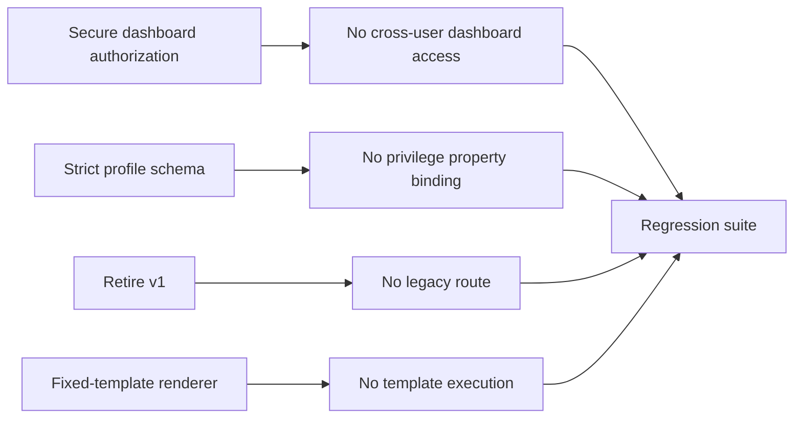

<p align="center">
  <strong>Created by Ziad Osama El-Boshy</strong><br />
  <sub>Challenge author &amp; creator</sub>
</p>

# Remediation guide

**firmdrama · Secure-state design and retest guidance · Reviewed 10 September 2026**

> **Important:** These recommendations describe how to remediate a production
> system. Do not apply them to the training build unless creating a separate
> secure comparison version; they intentionally remove the challenge path.

## Priority view

| Priority | Finding family | Production-safe outcome |
|---:|---|---|
| P0 | API1 BOLA | Enforce object and nested-resource authorization |
| P0 | API3 BOPLA | Reject role changes in normal profile updates |
| P1 | API9 inventory | Remove the retired v1 service from deployment |
| P0 | SSTI | Render untrusted text as data, never template source |
| P1 | Operational safeguards | Retain container isolation, auditability, and secure deployment controls |

## API1: Broken Object Level Authorization

### Root cause

The vulnerable resolver accepts a booking-to-dashboard relationship as proof
that the requester may access that dashboard. A discoverable object reference
is not an authorization grant.

### Secure implementation

1. Query the dashboard against the authenticated user or an explicit
   server-side access-control policy.
2. Apply the same policy to every nested conversation and message route.
3. Validate that each child object belongs to the authorized parent object.
4. Use opaque, non-enumerable public identifiers where appropriate, but do not
   treat unguessable IDs as an authorization control.

### Retest

An associate requesting James's dashboard, conversation, or message context
receives a denial. Mike's own dashboard still works. Attempts to combine a
permitted dashboard with another dashboard's conversation or message fail.

## API3: Broken Object Property Level Authorization

### Root cause

An ordinary profile update accepts `role_id` and treats possession of a
delegation approval as authority. It does not bind the approval to James, and
it represents temporary module access as a global firm role.

### Secure implementation

1. Define an explicit profile-update schema containing only mutable contact
   fields.
2. Reject `role_id`, ownership, permissions, and all other security-sensitive
   properties at the API boundary.
3. Move role changes to a dedicated, privileged workflow with server-side
   authorization, audit logging, and separation of duties.
4. Model temporary Facilities access as a scoped, time-bounded grant with an
   intended subject, resource scope, expiry, and replay protection.
5. Validate the grant's subject against the authenticated principal before any
   elevation.

### Retest

Normal profile edits succeed. Supplying any role property fails, including with
a valid, stolen, expired, or replayed approval. A real delegated user can use
only the specifically granted Facilities capability without acquiring Olivia's
global role.

## API9: Improper Inventory Management

### Root cause

An obsolete v1 endpoint remains deployed beside the current v3 API. The retired
version has different, weaker security behavior.

### Secure implementation

- Maintain an authoritative inventory of public and internal API versions.
- Remove v1 routing, code, tests, and container artifacts after migration.
- Enforce a documented deprecation schedule with telemetry and owner approval.
- If temporary compatibility is unavoidable, put the version behind the same
  authentication, validation, template-safety, logging, and monitoring controls
  as v3.

### Retest

Version probes for retired versions return a generic `404` without source paths,
feature hints, flags, or legacy behavior. The current API alone remains served.

## SSTI / injection

### Root cause

The legacy preview passes the entire attacker-controlled request value to
Jinja's dynamic template renderer.

### Secure implementation

Use a fixed template and pass the untrusted value as data:

```python
# Safe pattern: the template source is fixed; user text is a value.
return render_template("ticket_preview.html", body=user_supplied_body)
```

Apply context-appropriate escaping, avoid dynamic template loading from request
data, and add tests that assert template syntax remains literal in every
supported preview path.

### Retest

Expressions such as `{{7*7}}` render as text or escaped markup. The process
cannot read the simulated file through user-controlled preview input.

## Operational security controls to retain

The following controls are compatible with a secure production architecture and
should be kept after the intentional weaknesses are removed:

- dedicated non-root runtime users;
- read-only root filesystems with narrowly scoped writable storage;
- dropped Linux capabilities and `no-new-privileges`;
- no Docker socket, privileged mode, host mounts, or published database port;
- TLS-aware secure cookie configuration and strict trusted-host configuration;
- login rate limiting, opaque session-token storage, logout revocation, body
  limits, input validation, and response-security headers;
- central audit logging for authorization and privilege changes; and
- regression tests for object authorization, update allowlists, API inventory,
  and template safety.

## Remediation verification matrix



Document residual risk, test results, and an approved rollback plan before
releasing any remediated production service.

---

[Documentation index](README.md) · [Operations](operations.mdx) · [Validation and acceptance](validation-report.mdx)
