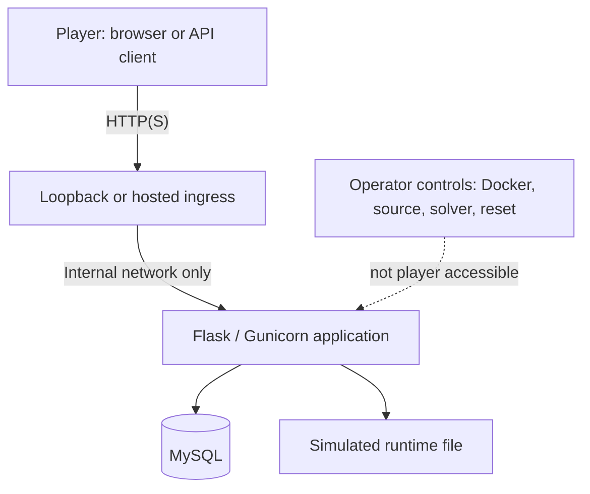
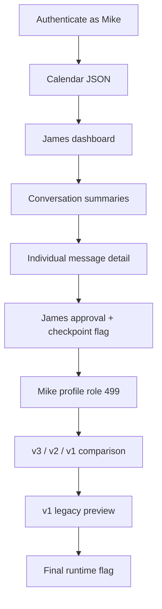

<p align="center">
  <strong>Created by Ziad Osama El-Boshy</strong><br />
  <sub>Challenge author &amp; creator</sub>
</p>

# Security report

**firmdrama · Task 01 technical assessment · Reviewed 10 September 2026**

> **Classification:** Training documentation. All people, data, credentials,
> services, and flags are fictional. The described weaknesses are deliberate
> learning mechanisms and must not be deployed in a production system.

## Report navigation

| Context | Findings and impact | Resolution and review |
| :--- | :--- | :--- |
| [9.1 Executive summary](#91-executive-summary) | [9.6 Vulnerabilities](#96-vulnerability-descriptions) | [9.11 Remediation](#911-remediation) |
| [9.2 Challenge overview](#92-challenge-overview) | [9.7 Intended path](#97-intended-attack-path) | [9.12 Verification](#912-verification-and-retest) |
| [9.3 Architecture](#93-architecture-and-trust-boundaries) | [9.8 Impact](#98-impact-assessment) | [9.13 Unintended paths](#913-unintended-attack-paths) |
| [9.4 Starting point](#94-attacker-starting-point) | [9.9 Flag condition](#99-flag-retrieval) | [9.14 Conclusion](#914-conclusion) |
| [9.5 Attack surface](#95-relevant-attack-surface) | [9.10 Root causes](#910-root-cause-summary) | [Supporting evidence](security-report.mdx#appendix-a-sanitized-evidence) |

Report section numbering follows assessment sections 9.1-9.14. The
[validation report](validation-report.mdx) distinguishes historical application
evidence from subsequent checks and the recorded acceptance decisions.

## 9.1 Executive summary

firmdrama is a self-contained API and web-security CTF based on RoomReserve,
Alder & Vale's fictional internal booking system. Its primary learning
objective is **Advanced API Chaining**: an authenticated associate turns
discovery metadata into unauthorized object access, extracts a misplaced
delegation from private message detail, modifies a protected role property,
finds a retired API version, and reaches an isolated legacy SSTI preview.

The demonstrated business impact is simulated confidential-message disclosure,
unauthorized privilege elevation, access to retired Facilities functionality,
and read access to a simulated protected file. The intended chain combines
API1:2023 BOLA, API3:2023 BOPLA, API9:2023 Improper Inventory Management, and
OWASP Top 10:2021 A03 Injection (SSTI).

## 9.2 Challenge overview

| Attribute | Value |
|---|---|
| Application | RoomReserve meeting-room and Facilities portal |
| Attacker | Mike, authenticated Associate |
| Difficulty | Hard |
| Expected solve time | 75-120 minutes |
| Primary family | Advanced API Chaining |
| Primary API weaknesses | API1:2023 BOLA, API3:2023 BOPLA, API9:2023 Improper Inventory Management |
| Secondary weakness | Server-Side Template Injection, OWASP Top 10:2021 A03 Injection |
| Protocol | REST over HTTP with JSON; GraphQL and gRPC are not used |
| Completion evidence | Intermediate and final runtime-generated flags |
| Isolation | Local/hosted lab only; no real accounts, data, or external service |

Mike's normal account can manage bookings, profile details, notifications, and
his own requests. James is a non-administrator senior partner. Olivia is the
managing partner. The scenario deliberately avoids requiring outside knowledge
of the fictional setting.

## 9.3 Architecture and trust boundaries



| Boundary | Security control | Intentional defect |
|---|---|---|
| Authentication | Opaque hashed sessions; browser cookie controls; rate limiting | None |
| Object access | Dashboard and nested relationship lookup | Booking relation wrongly authorizes James dashboard access |
| Profile mutation | Own-object restriction, target-role validation, atomic approval consumption | Role property remains accepted and approval subject and source role are not bound |
| Facilities API | Role gate and safe v3 renderer | Retired v1 surface remains deployed and unsafe |
| Runtime / host | Non-root, read-only, no host mounts or added capabilities | The intended target is a simulated file; template execution has the app process's permissions |

## 9.4 Attacker starting point

- **Credential:** `thisismike` / `mike@123`
- **Initial role:** Associate (`1`)
- **Known capability:** normal RoomReserve actions and normal API traffic
- **Assumption:** the player can inspect and modify authorized HTTP requests
- **Restrictions:** no admin account, host, Docker, database, source, solver,
  reset control, external service, or real target access

## 9.5 Relevant attack surface

| Surface | Purpose in assessment |
|---|---|
| Authentication and calendar APIs | Establish Mike's session and reveal business metadata |
| Dashboard and nested conversation APIs | Demonstrate BOLA and progressive information exposure |
| Own-profile `PATCH` | Demonstrate protected-property / delegation misuse |
| v3, v2, v1 Facilities APIs | Demonstrate version inventory and retired-surface discovery |
| Legacy v1 preview | Demonstrate the final isolated SSTI impact |
| Health and UI pages | Operational/ordinary behavior only; not a solution shortcut |

The exact HTTP methods, endpoint paths, and access boundaries are recorded in
the [design's HTTP surface reference](challenge-design.mdx#a2-http-surface).

## 9.6 Vulnerability descriptions

### FD-CTF-01 - API1: Broken Object Level Authorization

**Affected component:** dashboard lookup and nested dashboard context.

The calendar includes a legitimate booking-to-dashboard relationship. The
dashboard resolver incorrectly treats this relationship as authorization for
the requester, allowing Mike to retrieve James's dashboard. Subsequent
conversation traversal remains scoped to that wrongly authorized dashboard.

**Failed control:** ownership or explicit server-side access policy is absent
for the referenced dashboard object.

### FD-CTF-02 - API3: Broken Object Property Level Authorization

**Affected component:** Mike's normal profile update API.

The update path accepts a sensitive `role_id` property on Mike's own object.
It validates that a delegation approval exists, is fresh, unused, and scoped
to target role `499`, but does not validate that the approval was issued to
James rather than Mike or that the requester began as role `3`. The legacy
authorization model also maps temporary module authority to Olivia's global
managing-partner role.

**Failed control:** strict update allowlist and subject-bound, scoped delegation
authorization are absent.

### FD-CTF-03 - API9: Improper Inventory Management

**Affected component:** Facilities API versions.

v3 is the current secure implementation. v2 is absent, yet v1 remains
deployed after escalation and exposes a legacy preview workflow.

**Failed control:** the retired version was not removed or brought up to the
current security baseline.

### FD-CTF-04 - Server-Side Template Injection

**Affected component:** v1 ticket preview.

The v1 preview renders request-supplied text as Jinja template source. In the
isolated CTF, that allows the intended process-level read of the simulated final
file. The current v3 renderer does not share this behavior.

**Failed control:** untrusted data is treated as executable template source
instead of a variable in a fixed template.

## 9.7 Intended attack path



1. Mike authenticates and receives an opaque session token.
2. Calendar metadata identifies the partner booking relationship.
3. Mike manually requests the associated dashboard; James is returned while
   Mike remains the session principal.
4. Nested conversation metadata identifies the James-Olivia thread and its
   message summaries.
5. Individual message details expose sender role metadata. Only Olivia's
   final message exposes the fresh approval issued to James and the
   intermediate checkpoint flag.
6. Mike submits the protected role property with that approval to his own
   profile, reaching role `499`.
7. Mike compares the post-escalation v3, unavailable v2, and reachable v1
   Facilities routes.
8. The legacy preview processes a controlled template expression and returns
   the simulated file content containing the final flag.

Sanitized request and response excerpts are in
[Appendix A: sanitized evidence](#appendix-a-sanitized-evidence).

## 9.8 Impact assessment

| Dimension | Demonstrated impact |
|---|---|
| Confidentiality | Private James-Olivia conversation and simulated Olivia file content |
| Integrity | Mike changes his own global role and reaches role-gated Facilities behavior |
| Availability | No availability impact is intended or required for the chain |
| Privilege | Associate obtains managing-partner Facilities access |
| Containment | Intended impact uses fictional in-container data; container controls reduce host exposure but do not restrict template execution to one file |

## 9.9 Flag retrieval

The intermediate value confirms the BOLA/conversation milestone but is not the
completion condition. The final value is independently generated on reset,
stored in the simulated file, and returned only after the intended legacy v1
preview result. Both match the full-string regular expression `^duck\{[a-z]{24}\}$`; documentation never retains
their runtime values. For local delivery, the zero-dependency
[`scripts/check.py`](../scripts/check.py) compares one captured value with the
current SHA-256 digests in `lab.yml` and labels a checkpoint or final match
without receiving either plaintext value from the application.

## 9.10 Root-cause summary

The chain exists because several related controls fail in sequence: object
authorization trusts a discovered relationship, generic profile binding accepts
a protected property, delegation validation misses the intended recipient,
retired API inventory remains deployed, and untrusted input becomes template
source. No single failure alone is presented as the full lesson.

## 9.11 Remediation

The production remediation order is:

1. Enforce object and nested-resource authorization.
2. Remove role properties from ordinary profile schemas and use scoped,
   subject-bound delegated grants.
3. Retire v1 completely or align it with the secure current implementation.
4. Use fixed templates with untrusted data passed as values.

Detailed implementation and retest guidance is in
[`remediation.mdx`](remediation.mdx).

## 9.12 Verification and retest

The secure-state retest must deny James dashboard access to Mike, reject any
role property in normal profile updates, reject a stolen/expired/replayed
delegation, return a generic response for v1, and render template expressions
as literal text. Existing challenge tests demonstrate the vulnerable-state
boundaries; a production remediation branch requires corresponding inverted
assertions.

The release validator rebuilds images, starts clean state, runs tests, solves
through ingress, resets, checks containment, and tears down. See
[`validation-report.mdx`](validation-report.mdx).

## 9.13 Unintended attack paths

The regression suite verifies that these alternatives do not bypass the chain:

- direct Olivia-dashboard access;
- arbitrary dashboard/conversation/message combinations;
- edits to James or Olivia;
- arbitrary, missing, expired, or replayed approvals;
- pre-escalation v3/v1 access and direct legacy preview;
- unauthenticated access, forged bearer tokens, and login bypass;
- direct HTTP access to the simulated file; and
- static/source/configuration/image-metadata flag disclosure.

The user interface is also tested to ensure it contains no victim-dashboard,
message-detail, role-activation, or legacy-preview shortcut.

The [hardening record](operations.mdx#appendix-a-hardening-record) documents
the surrounding changes, including removal of UI shortcuts and protection of
the browser, transaction, and container boundaries.

## 9.14 Conclusion

firmdrama is a repeatable, contained training exercise in how believable API
and legacy-rendering defects compound. Runtime-generated flags, reset behavior,
role boundaries, documentation, automated validation, and an API-only solver
support evaluator review using fictional systems and data. The ingress
connection-cleanup change is documented and its focused checks pass. The
[validation report](validation-report.mdx) records historical acceptance and the current deployment review, including
the verified Docker-host gateway correction and host-side container reset.

## Appendix A. Sanitized evidence

> **Redaction standard:** Bearer tokens, dynamic approval IDs, runtime flags,
> and unnecessary private message text are replaced with angle-bracket
> placeholders. Examples demonstrate behavior, not reusable secrets.

> **Evidence provenance:** The API excerpts below are previously documented,
> sanitized behavioral examples. They were not recaptured during the ingress
> documentation review. Current checks, dates, and limitations are recorded in
> the [validation report](validation-report.mdx).

### Health and session establishment

```http
GET /health
```

```http
HTTP/1.1 200 OK
Content-Type: application/json

{"service":"firmdrama","status":"ok"}
```

```http
POST /api/v1/auth/login
Content-Type: application/json

{"username":"thisismike","password":"<player credential>"}
```

```json
{"token":"<redacted>","user":{"id":1,"username":"thisismike","display_name":"Mike","role_id":1,"role_name":"Associate"}}
```

### API1 BOLA boundary

```http
GET /api/v1/bookings/calendar
Authorization: Bearer <redacted>
```

```json
{"bookings":[{"booking_id":7001,"room_name":"The War Room","reserved_by":"James","matter_code":"NH-2187","dashboard_id":1042,"status":"confirmed"},{"booking_id":7002,"room_name":"The Library","reserved_by":"Mike","matter_code":"MR-4102","dashboard_id":1001,"status":"confirmed"}]}
```

```http
GET /api/v1/dashboards/1042
Authorization: Bearer <redacted>
```

```json
{"dashboard_id":1042,"owner":{"id":2,"display_name":"James","role_id":3,"role_name":"Senior Partner"},"widgets":["calendar","messages","notifications"]}
```

The dashboard owner changes to James; the session principal does not.

### Progressive message disclosure

Conversation-level data presents summaries only:

```json
{"conversation_id":5001,"messages":[{"message_id":9006,"sender":"Olivia","body_preview":"<sanitized text> duck{","created_at":"2026-08-28T09:34:00Z"}]}
```

Individual message detail adds the intended restricted fields:

```json
{"message_id":9006,"sender":{"id":3,"display_name":"Olivia"},"recipient":{"id":2,"display_name":"James"},"body":"<sanitized body>\n<redacted intermediate flag>\napproval ID: <redacted>","metadata":{"sender_role_id":499}}
```

### API3 BOPLA boundary

```http
PATCH /api/v1/users/1/profile
Authorization: Bearer <redacted>
Content-Type: application/json

{"role_id":499,"delegation_approval_id":"<redacted approval issued to James>"}
```

```json
{"id":1,"username":"thisismike","display_name":"Mike","role_id":499,"role_name":"Managing Partner"}
```

Negative assertions confirm a missing, invalid, expired, or consumed approval
returns `403`; attempts to alter James or Olivia return `404`; target roles
other than `499` return `400`. A valid stolen approval for James can still
move Mike from role `1` to role `499`.

### API9 and SSTI boundary

```text
GET /api/v3/dashboard -> 200 OK after role transition
GET /api/v2/dashboard -> 404 Not Found
GET /api/v1/dashboard -> 200 OK after role transition
```

```http
POST /api/v1/tickets/1001/preview
Authorization: Bearer <redacted>
Content-Type: application/json

{"body":"<controlled Jinja file-read expression documented in official solution>"}
```

```json
{"version":"v1","ticket_id":1001,"preview_html":"<simulated file content including redacted final flag>"}
```

### Shortcut and containment evidence

| Attempt | Verified outcome |
|---|---|
| API without a token | `401` |
| Forged bearer token | `401` |
| Olivia dashboard as Mike | `404` |
| Arbitrary conversation/message context | `404` |
| v3/v1 before elevation | `403` |
| Direct HTTP final-file request | `404` |
| UI victim-dashboard or legacy link | Not present |
| Static source/asset flag pattern | Not present |
| Image history/config flag pattern | Not present in validator checks |

### Browser evidence

The previously recorded browser regression check covered one-click sign-in, clean labeled
calendar metadata, no link from James's booking to a dashboard, server-side
page authentication, hidden Facilities navigation for Mike, and working
normal-user request/notification pages. Screenshots are intentionally retained
only as local test artifacts because they are regenerated and not required to
reproduce the API behavior.

---

[Documentation index](README.md) · [Operations](operations.mdx) · [Validation and acceptance](validation-report.mdx)
